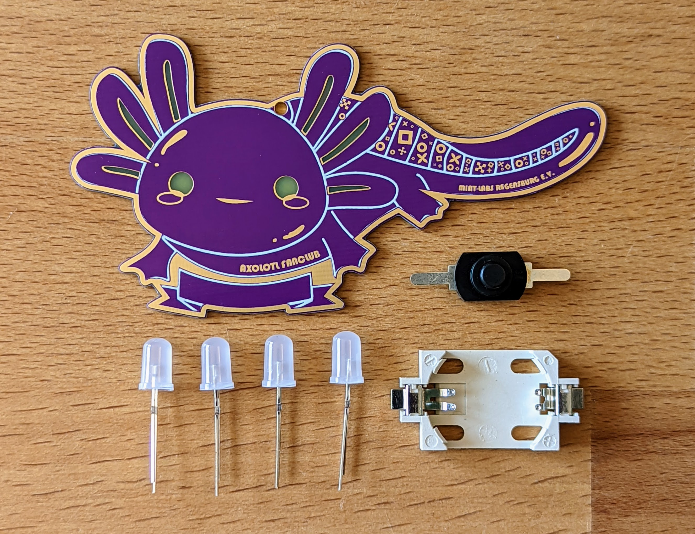
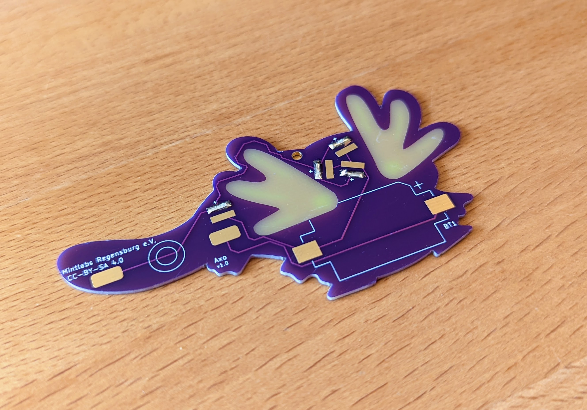
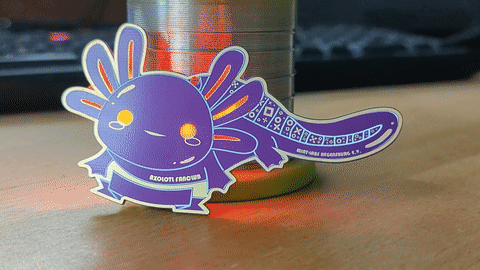

# Axo Badge

How cool are axolotls? If you're as big a fan as we are, or want to become one, then this badge is just the thing for you. When you've finished soldering the Axolotl soldering kit, your Axolotl's eyes and gills will glow in all the colours of the rainbow.

 

The RGB-Effect looks like this, but much better in real :)

- Status: **Complete**
- Difficulty: **2/5**

### Parts List

| Description                   | Quantity |
|-------------------------------|----------|
| RGB LEDs 5mm                  |     4    |
| Button (SMD)                  |     1    |
| CR2032 Battery Holder (SMD)   |     1    |
| CR2032 Battery (not included) |     1    |

### Copyright and Authorship

- Board: [CC-BY-SA 4.0](https://creativecommons.org/licenses/by-sa/4.0/) - Timo Schindler @ blinkyparts.com
- Axolotl SVG - Made by the wonderful Dani from Mint Labs Regensburg e.V.

### Buy Soldering Kits
If you want to buy the parts and PCB for a soldering kit you can find everything here: [shop.blinkyparts.com](https://shop.blinkyparts.com/de/Axolotl-Fanclub-Badge-Ein-Aushaengeschild-fuer-absolute-Axolotl-Fans/blink235042)
