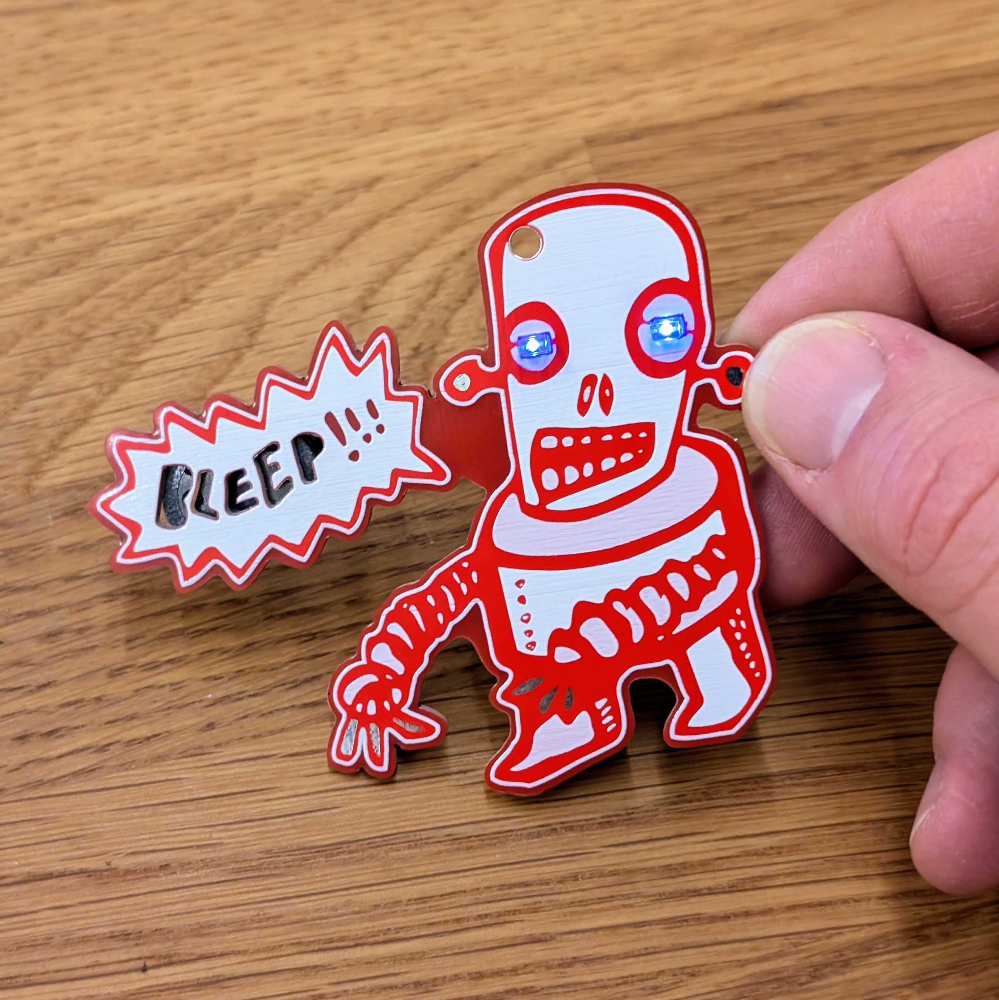

# BleepBot - Your talking robot

An easy soldering kit for a "talking bleepbot". Every part is soldered very strange, but wonderful. Once assembled, the BleepBot is talking with you and others with his cupe robot voice.

 

- Status: **Complete**
- Difficulty: **2/5**

### Parts List

| Description                   | Quantity |
|-------------------------------|----------|
| LEDs blue                     |     2    |
| Resistor 10k                  |     2    |
| Ceramic capacitor             |     1    |
| Transistor 2N3904             |     1    |
| ATtiny25                      |     1    |
| Loudspeaker                   |     1    |
| Slide Switch                  |     1    |
| Battery Holder                |     1    |
| CR2032 Battery (not included) |     1    |
| BleepBot (PCB)				|     1    |

### Copyright and Authorship

- Board: [CC-BY-SA 4.0](https://creativecommons.org/licenses/by-sa/4.0/) - [noisio.de](https://www.noisio.de)

### Buy Soldering Kits
If you want to buy the parts and PCB for a soldering kit you can find everything here: [shop.blinkyparts.com](https://shop.blinkyparts.com/)
