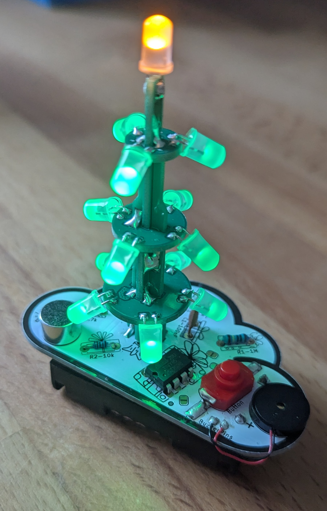

# BlinkyTree
A festive Christmas tree soldering kit with twinkling LEDs and microphone blow detection that creates beautiful interactive light displays for the holiday season.

- Status: **In Development**
- Difficulty: **3/5**

### Features
- **4 LED rings** with concentric Christmas tree pattern (total 13 LEDs)
- **Microphone blow detection** - blow to change lighting modes  
- **6 different lighting patterns**: steady, twinkling, chase, breathing, and off
- **ATtiny85 microcontroller** for compact, efficient control
- **Battery powered** (3V coin cell or 2x AA) for portability
- **Christmas tree PCB shape** with festive silkscreen design

### Parts List

| Quantity | Name(s)       | Description                 | Label / Color Code                          |
|----------|---------------|-----------------------------|---------------------------------------------|
| 1        | IC1           | Microcontroller ATtiny85    | ATtiny85-20PU                               |
| 1        | C1            | Ceramic Capacitor 100nF     | 104                                         |
| 1        | R1-R4         | Resistor 220Ω (4x)          | Red · Red · Black · Black · Brown           |
| 1        | R5            | Resistor 10kΩ               | Brown · Black · Black · Red · Brown         |
| 3        | LED1-LED3     | LED 3mm Green (inner ring)  | Green LEDs                                  |
| 4        | LED4-LED7     | LED 3mm Green (middle ring) | Green LEDs                                  |
| 5        | LED8-LED12    | LED 3mm Green (outer ring)  | Green LEDs                                  |
| 1        | LED13         | LED 3mm Yellow (star)       | Yellow LED                                  |
| 1        | MIC1          | Electret Microphone         | Small black microphone                      |
| 1        | SW1           | Slide Switch                | SPDT mini slide switch                      |
| 1        | BAT1          | Battery Holder              | CR2032 coin cell holder                     |
| 1        | –             | Printed Circuit Board (PCB) | Christmas Tree Shape                        |
| 1        | –             | CR2032 Battery              | *(not included)*                            |

### How It Works
The BlinkyTree uses an ATtiny85 microcontroller to control four concentric rings of LEDs arranged in a Christmas tree pattern. The microphone detects when you blow on it and cycles through different lighting modes:

1. **Normal Flickering** - LEDs gently flicker like candles
2. **Bright Up** - LEDs brighten when you blow on them
3. **Dim Down** - LEDs dim when you stop blowing  
4. **Off Mode** - All LEDs turn off, blow to turn back on
5. **Twinkling** - Random sparkle effects
6. **Breathing** - Slow fade in and out

### Circuit Design
- **Power Supply**: 3V CR2032 coin cell battery
- **LED Control**: 4 groups of LEDs controlled via current-limiting resistors
- **Microphone Input**: Electret microphone connected to ADC for blow detection
- **Low Power**: Software PWM and sleep modes for extended battery life

### Manual
You can find the manual and pictures of every step in the manual folder.

### Copyright and Authorship
- Board: [CC-BY-NC 4.0](https://creativecommons.org/licenses/by-nc/4.0/)
- Manual (TeX): [LPPL](https://www.latex-project.org/lppl.txt/)  
- Manual (pdf): [CC-BY-NC 4.0](https://creativecommons.org/licenses/by-nc/4.0/)

### Buy Soldering Kits
Information about purchasing this kit will be available soon.