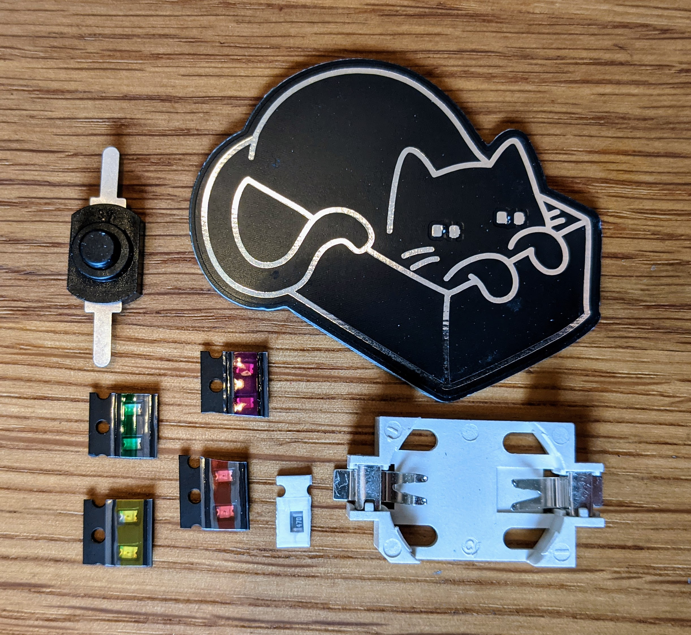

# Cat in a Box

A Cat in a box easy SMD kit. Bright glowing LED-eyes are watching every step! With this soldering kit it is super easy to learn SMD soldering.

 

- Status: **Complete**
- Difficulty: **2/5**

### Parts List

| Description                   | Quantity |
|-------------------------------|----------|
| SMD LED 0805                  |     2    |
| 0805 SMD Resistor 47 Ohm	|     1    |
| Button (SMD)                  |     1    |
| CR2032 Battery Holder (SMD)   |     1    |
| CR2032 Battery (not included) |     1    |

### Copyright and Authorship

- Board: [CC-BY-SA 4.0](https://creativecommons.org/licenses/by-sa/4.0/) - Timo Schindler
- Cat SVG [CC-BY-SA](https://creativecommons.org/licenses/by-sa/4.0/) - [box cat by Denis Sazhin from the Noun Project](https://thenounproject.com/term/box-cat/704953/) (We've bought a licence, you should honor the artist work too!)

### Buy Soldering Kits
If you want to buy the parts and PCB for a soldering kit you can find everything here: [shop.blinkyparts.com](https://shop.blinkyparts.com/de/Katzen-Loetbausatz-01-Einfacher-SMD-Bausatz-zum-sammeln-und-tauschen/blink232342)
