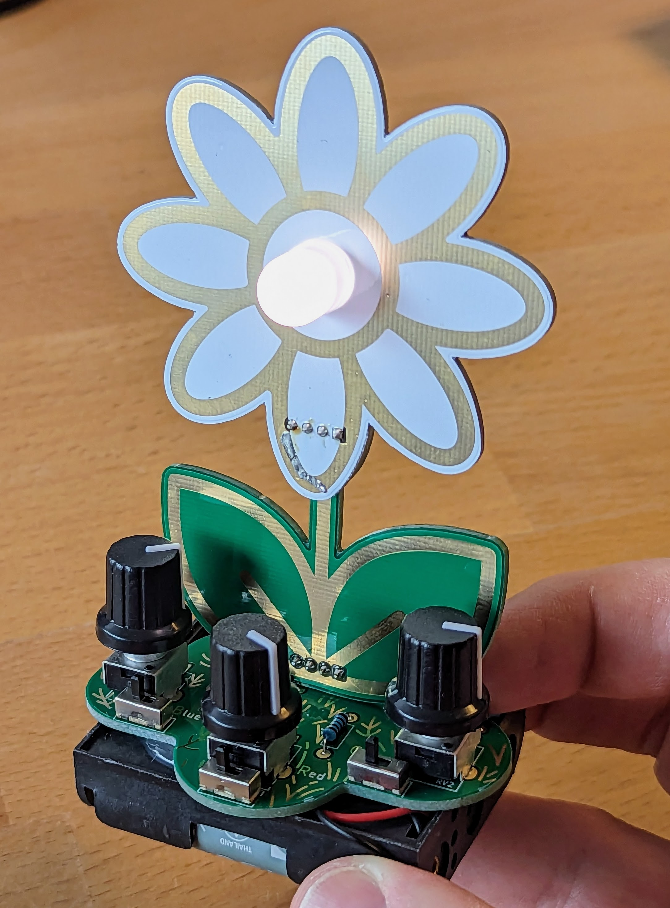

# Daisy RGB

This 3D construction kit allows you to solder a personalized daisy with a large RGB LED in the center, with colors adjustable using variable resistors and overall brightness and individual colors adjustable via slide switches. It is a DIY project that involves electronics, crafting, and creativity to create a unique personal project.

 

- Status: **Complete**
- Difficulty: **2/5**

### Parts List

| Quantity | Description                                       |
|----------|---------------------------------------------------|
|    1     | RGB LED 10 mm                                     |
|    1     | Pressure switch                                   |
|    3     | Slide switch                                      |
|    3     | 100 Ω resistor                                    |
|    1     | Pin header straight (4 pins)                      |
|    1     | Pin header L-shaped (4 pins)                      |
|    1     | Potentiometer 2 kΩ blue                           |
|    3     | Potentiometer 2 kΩ black                          |
|    3     | Caps for potentiometer                            |
|    1     | 3xAA battery holder                               |
|    3     | AA rechargeable battery or battery (not included) |
|    1     | Printed circuit board (PCB)                       |

### Copyright and Authorship

- Board: [CC-BY-SA 4.0](https://creativecommons.org/licenses/by-sa/4.0/) - Timo @ blinkyparts.com
- Flower SVG [CC-BY 3.0](https://creativecommons.org/licenses/by/3.0/) - [daisy by Jasmine from Noun Project](https://thenounproject.com/icon/daisy-4840366/) (We've bought a licence, you should honor the artist work too!)
- Grass SVG [CC-BY 3.0](https://creativecommons.org/licenses/by/3.0/) - [grass by Softscape from Noun Project](https://thenounproject.com/icon/grass-4708462/) (We've bought a licence, you should honor the artist work too!)
- Cloud SVG [CC-BY 3.0](https://creativecommons.org/licenses/by/3.0/) - [Cloud by verry poernomo from Noun Project](https://thenounproject.com/icon/cloud-5383467/) (We've bought a licence, you should honor the artist work too!)

### Buy Soldering Kits
If you want to buy the parts and PCB for a soldering kit you can find everything here: [shop.blinkyparts.com](https://shop.blinkyparts.com/de/Gaensebluemchen-RGB-Zeig-jedem-deine-lieblings-Blume-in-Regenbogenfarben/blink237342)
