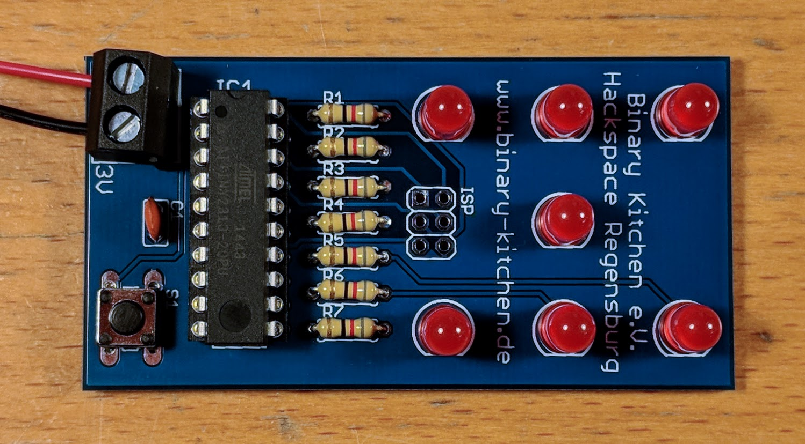

# Dice Microcontroller - DIP
Electronic dice with Microcontroller and less parts.

- Status: **Complete**
- Difficulty: **2/5**

### Parts List

| Menge | Name            | Beschreibung                       | Beschriftung/Farbcode |
|-------|-----------------|------------------------------------|-----------------------|
| 1     | C1              | Keramik Kondensator 100nF          |                       |
| 1     | IC1             | Mikrocontroller Atmel ATTiny 2313A |                       |
| 7     | LED1 - LED7     | 5mm LED                            |                       |
| 7     | R1 - R7         | Widerstand 82 Ohm                  | 470                   |
| 1     | S1              | Taster                             |                       |
| 1     | X1              | Klemme 2-polig                     |                       |
| 1     |                 | IC-Sockel 20-polig                 |                       |
| 1     |                 | Batteriehalter                     |                       |
| 2     |                 | Batterie Mignon (AA)               |                       |
| 1     |                 | Platine                            |                       |

### Manual
You can find the manual and pictures of every step in the manual folder.

### Copyright
- Board: CC-BY-NC-SA - Thomas Basler
- Manual: CC-BY-SA - Binary Kitchen e.V.
