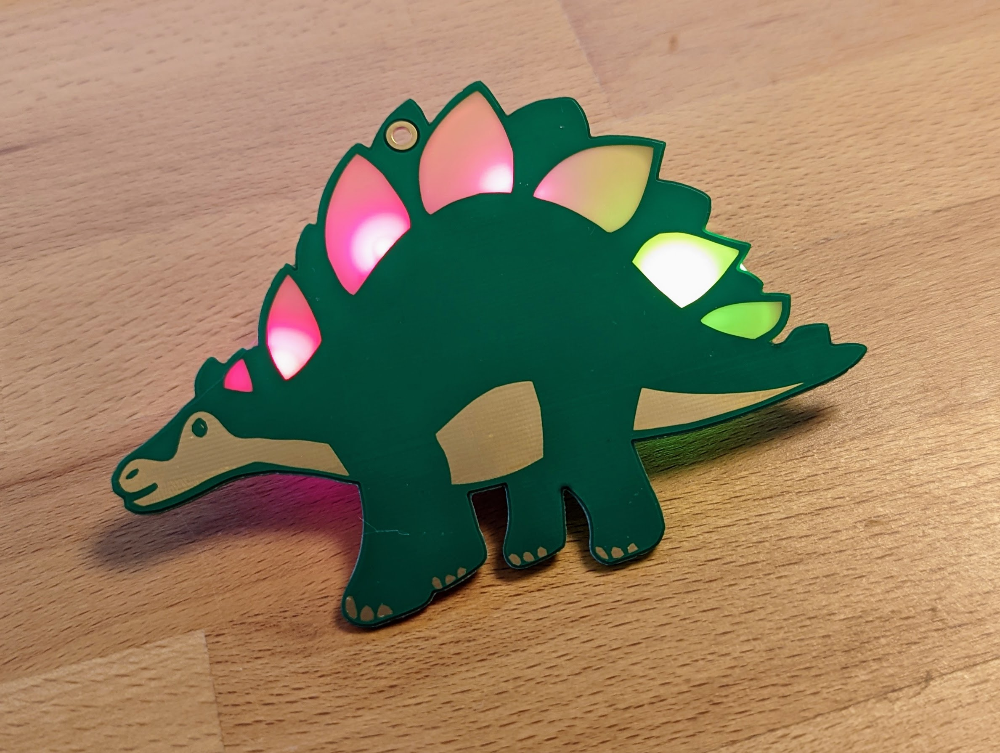

# Dino

This rainbow dinosaur will brighten up your life. The spikes are glowing in all colours of the rainbow due to RGB-LEDs on the back. The soldering kit is very simple and easy to assemble.

 

The RGB-Effect looks like this, but much better in real :)

- Status: **Complete**
- Difficulty: **2/5**

### Parts List

| Description                   | Quantity |
|-------------------------------|----------|
| RGB LEDs 5mm                  |     4    |
| Button (SMD)                  |     1    |
| CR2032 Battery Holder (SMD)   |     1    |
| CR2032 Battery (not included) |     1    |

### Copyright and Authorship

- Board-Design: [CC-BY-SA 4.0](https://creativecommons.org/licenses/by-sa/4.0/) - Taxxizz, x70b1 & Timo Schindler @ Binary Kitchen e.V.
- Artwork [CC-BY-SA 4.0 ](https://creativecommons.org/licenses/by-sa/4.0/) - kunkelkunst

### Buy Soldering Kits
If you want to buy the parts and PCB for a soldering kit you can find everything here: [shop.blinkyparts.com](https://shop.blinkyparts.com/de/Regenbogen-Einhorn-Einfacher-Bausatz-fuer-einen-tollen-Anstecker/blink232242)
