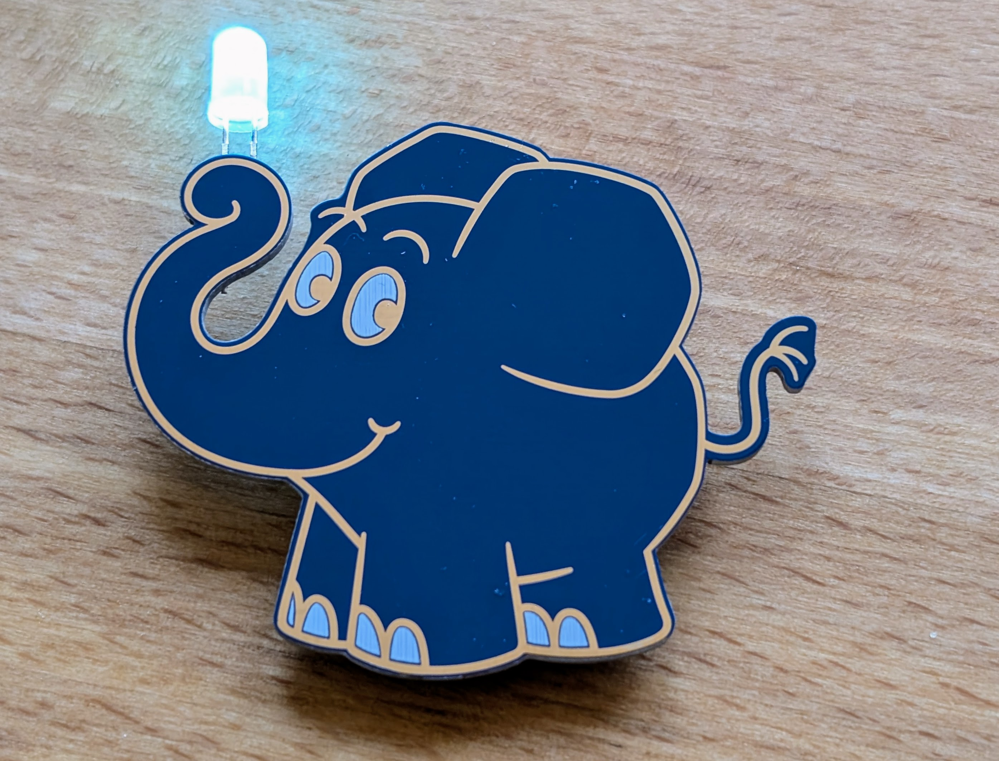

# Die Maus - Elefant

Everyone knows the great elephant from the “Sendung mit der Maus” and, as always, he has a good idea. An LED in the trunk that lights up in RGB colors.

 

- Status: **Complete**
- Difficulty: **2/5**

### Parts List

| Description                   | Quantity |
|-------------------------------|----------|
| RGB LEDs 5mm                  |     1    |
| Button (SMD)                  |     1    |
| CR2032 Battery Holder (SMD)   |     1    |
| CR2032 Battery (not included) |     1    |
| Elefant (PCB)		        	|     1    |
| Butterfly pin with nail       |     1    |

### Copyright and Authorship

- Graphic: Copyright belongs to WDR - Attention not usable without permission.
- Board: [CC-BY-SA 4.0](https://creativecommons.org/licenses/by-sa/4.0/) - Timo Schindler @ [blinkyparts.com](https://shop.blinkyparts.com)

### Buy Soldering Kits
Unfortunately, you can't just buy this great elephant. We are only allowed to give the elephants to organizations that take part in the “Türen auf mit der Maus” day. Are you one of these organizations? Please get in touch with us: [shop.blinkyparts.com](https://shop.blinkyparts.com/)
