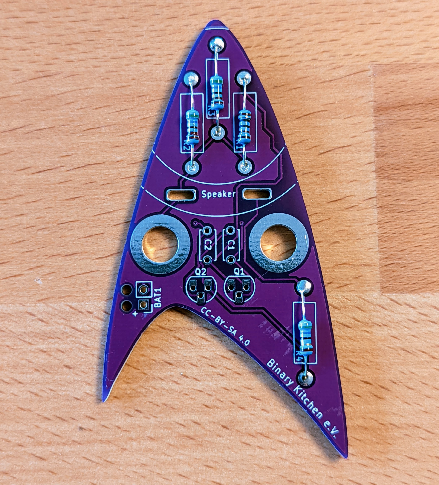
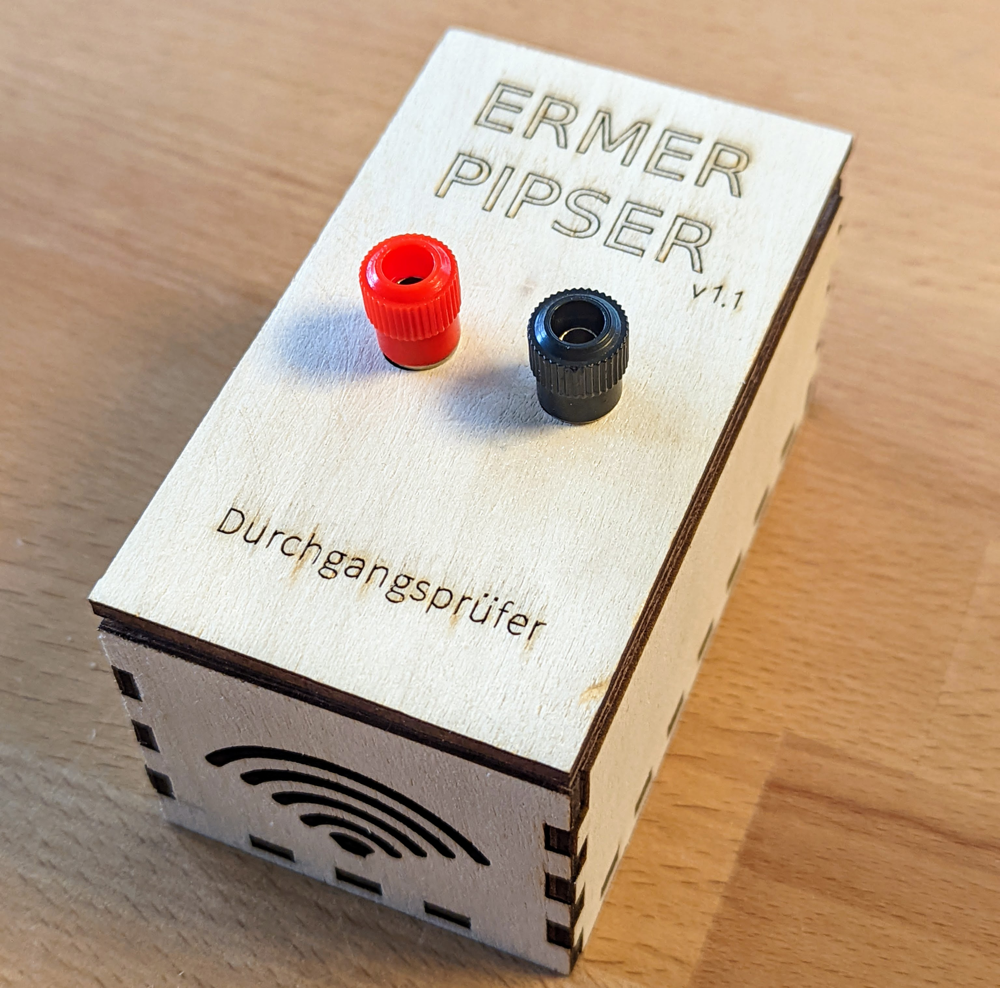

# Ermer Beeper - DIP

The Ermer Beeper is a very neat continuity tester or beeper. This one is VERY fast and also faster than the most multimeters. No display, no LED, no switch. Just a speaker to beep you through your circuit. Based on a gread scientist [Christof Ermer]/https://homepages.uni-regensburg.de/~erc24492/)

 

- Status: **Complete**
- Difficulty: **2/5**

### Parts List

| Quantity | Name   | Description           | Signing/Colorcode             |
|----------|--------|-----------------------|-------------------------------|
| 2        | C1, C2 | 100nF capacitor       | 104                           |
| 1        | R1     | 1k Ohm resistor 1%    | brown-black-black-brown-brown |
| 2        | R2, R3 | 5,6k Ohm resistor 1%  | green-blue-black-brown-brown  |
| 1        | R4     | 56 Ohm resistor 1%    | green-blue-black-gold-brown   |
| 2        | Q1, Q2 | BC547C NPN transistor | BC547                         |
| 1        | LS1    | 50 Ohm speaker        |                               |
| 2        | J1, J2 | 4mm binding posts     |                               |
| 1        | BAT1   | 2xAA battery holder   |                               |
| 2        |        | 2xAA batteries*       |                               |
| 7        |        | wooden box parts**    |                               |
| 1        |        | PCB                   |                               |

* The batteries are not included in our kits.
** The wooden parts are optional.

### Manual
You can find the manual and pictures of every step here: https://github.com/Binary-Kitchen/SolderingTutorial

### Copyright and Authorship

- Board: [CC-BY-SA 4.0](https://creativecommons.org/licenses/by-sa/4.0/) - Timo Schindler
- Idea and scheme: [Christoph Ermer](https://homepages.uni-regensburg.de/~erc24492/)

### Buy Kits

You can also buy a kit @ [shop.blinkyparts.com](https://shop.blinkyparts.com).
