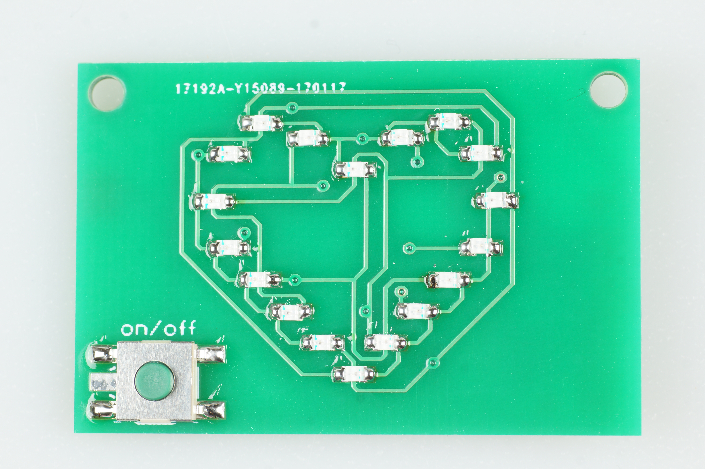

# Heart - SMD
Small soldering kit with an heart on it from http://wiki.blinkenarea.org/index.php/AKL-Mini

- Status: **Complete**
- Difficulty: **4/5**

### Parts List

| Menge | Name         | Beschreibung                       | Beschriftung/Farbcode |
|-------|--------------|------------------------------------|-----------------------|
| 1     | C1           | Keramik Kondensator 100nF          |                       |
| 1     | IC1          | Mikrocontroller Atmel ATTiny 2313A |                       |
| 18    | LED1 - LED18 | LED SMD 0805                       |                       |
| 6     | R1 - R6      | Widerstand 47 Ohm                  | 470                   |
| 1     | SW1          | Taster                             |                       |
| 1     | BAT1         | Batteriehalter                     |                       |
| 1     |              | Batterie CR2032                    |                       |
| 1     |              | Platine                            |                       |

### Manual
You can find the manual and pictures of every step in the manual folder.

###Copyright
The project is based on http://wiki.blinkenarea.org/index.php/AntiKippenLights-Mini

CC-BY-NC-SA - Arne Roussius
