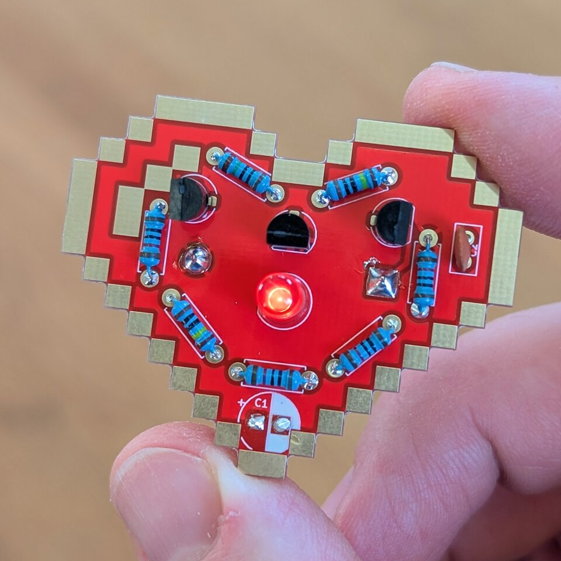

# Hearbeat - THT
Small soldering kit in form of an heart. A flashing (beating) LED is located in the center of the beating heart.

- Status: **Complete**
- Difficulty: **2/5**

### Parts List

| Quantity | Name | Description | Label/Color Code |
|----------|------|-------------|------------------|
| 2 | Q1–Q2 | BC547 transistor | |
| 1 | Q3 | BC557 transistor | |
| 1 | C1 | 100 µF electrolytic capacitor | |
| 1 | C2 | 100 nF ceramic capacitor (red) | 104 |
| 1 | D1 | LED red 5 mm | |
| 1 | BT1 | CR2032 battery holder | |
| 2 | R1, R6 | Resistor 1 MΩ | |
| 1 | R2 | Resistor 10 MΩ |  |
| 4 | R3–R5, R7 | Resistor 10 kΩ |  |
| 1 | — | Battery CR2032 (optional) | |
| 1 | — | Circuit board | |

### Manual
You can find the manual and pictures of every step in the manual folder.

### Where to buy a kit
You can buy a kit with all neede parts here: [https://shop.blinkyparts.com/de/Heartbeat-Loetbausatz-Pulsierendes-LED-Herz-zum-Selbstloeten/blink23185](https://shop.blinkyparts.com/de/Heartbeat-Loetbausatz-Pulsierendes-LED-Herz-zum-Selbstloeten/blink23185)

### Copyright and Authorship

- Board: [CC-BY-NC-SA 4.0](https://creativecommons.org/licenses/by-nc-sa/4.0/) - Timo Schindler @ [blinkyparts GmbH](https://shop.blinkyparts.com/de/Heartbeat-Loetbausatz-Pulsierendes-LED-Herz-zum-Selbstloeten/blink23185)
- Manual (TeX): [LPPL](https://www.latex-project.org/lppl.txt) - [Marei Peischl](https://peitex.de)
- Manual (pdf): [CC-BY-SA 4.0](https://creativecommons.org/licenses/by-sa/4.0/) - [Binary Kitchen e.V.](https://www.binary-kitchen.de)
