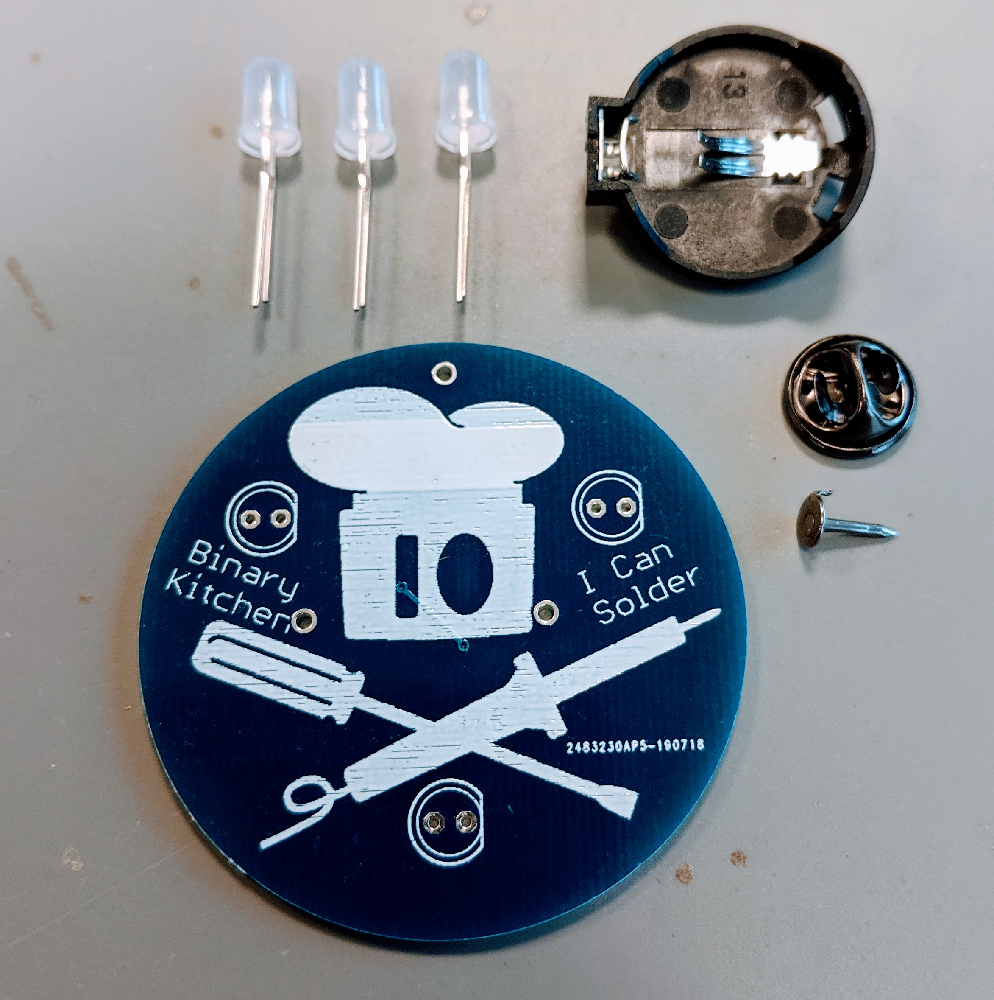

# I Can Solder - DIP
Very easy soldering kit for kids and beginners.

- Status: **Complete**
- Difficulty: **1/5**

### Parts List

| Amount | Name         | Description                        |
|--------|--------------|------------------------------------|
| 3      | LED1 - LED3  | LED 5mm RGB rainbow                |
| 1      |              | Battery holder                     |
| 1      |              | Buttefly pin                       |
| 1      |              | PCB                                |

### Manual
You can find the manual and pictures of every step in the manual folder.

### PCB Files
You can find the eagle and kicad PCB files in a seperate repository: https://github.com/Binary-Kitchen/ICanSolderDIP

### Copyright and Authorship

- Board: [CC-BY-SA 4.0](https://creativecommons.org/licenses/by-sa/4.0/) - Thomas Basler, Timo Schindler
- Manual (TeX): [LPPL](https://www.latex-project.org/lppl.txt) - [Marei Peischl](https://peitex.de)
- Manual (pdf): [CC-BY-SA 4.0](https://creativecommons.org/licenses/by-sa/4.0/) - [Binary Kitchen e.V.](https://www.binary-kitchen.de)

