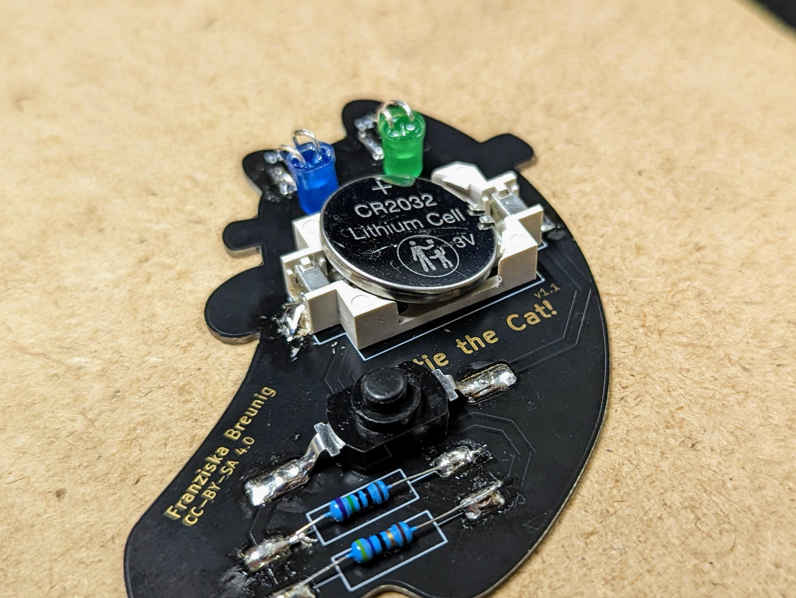

# Katie the Cat!

Katie is a cat! Katie is a cat with two eye colours! Katie is also a wonderfull and easy soldering kit for everyone who wants to learn solder. The most speical thing about Katie the Cat: Katie has been created by the eleven year old Franziska Breunig! How great is that?

 

- Status: **Complete**
- Difficulty: **2/5**

### Parts List

| Description                   | Quantity |
|-------------------------------|----------|
| Blue LEDs 5mm                 |     1    |
| Green LEDs 5mm                |     1    |
| Resistor 750 Ohm		|     1	   |
| Resistor 47 Ohm		|     1	   |
| Button                        |     1    |
| CR2032 Battery Holder (SMD)   |     1    |
| CR2032 Battery (not included) |     1    |
| Board (PCB)			|     1	   |

### Copyright and Authorship

- Board: [CC-BY-SA 4.0](https://creativecommons.org/licenses/by-sa/4.0/) - Franziska Breunig
- Katie the Cat SVG [CC-BY-SA](https://creativecommons.org/licenses/by-sa/4.0/) - [Cat by Denis Sazhin from the Noun Project](https://thenounproject.com/icon/cat-704946/) (We've bought a licence, you should honor the artist work too!)

### Buy Soldering Kits
If you want to buy the parts and PCB for a soldering kit you can find everything here: [shop.blinkyparts.com Soldering Kits](https://shop.blinkyparts.com/de/Katie-the-Cat-Ein-einfacher-Katzenloetbausatz-mit-besonderen-Augen/blink235142)
