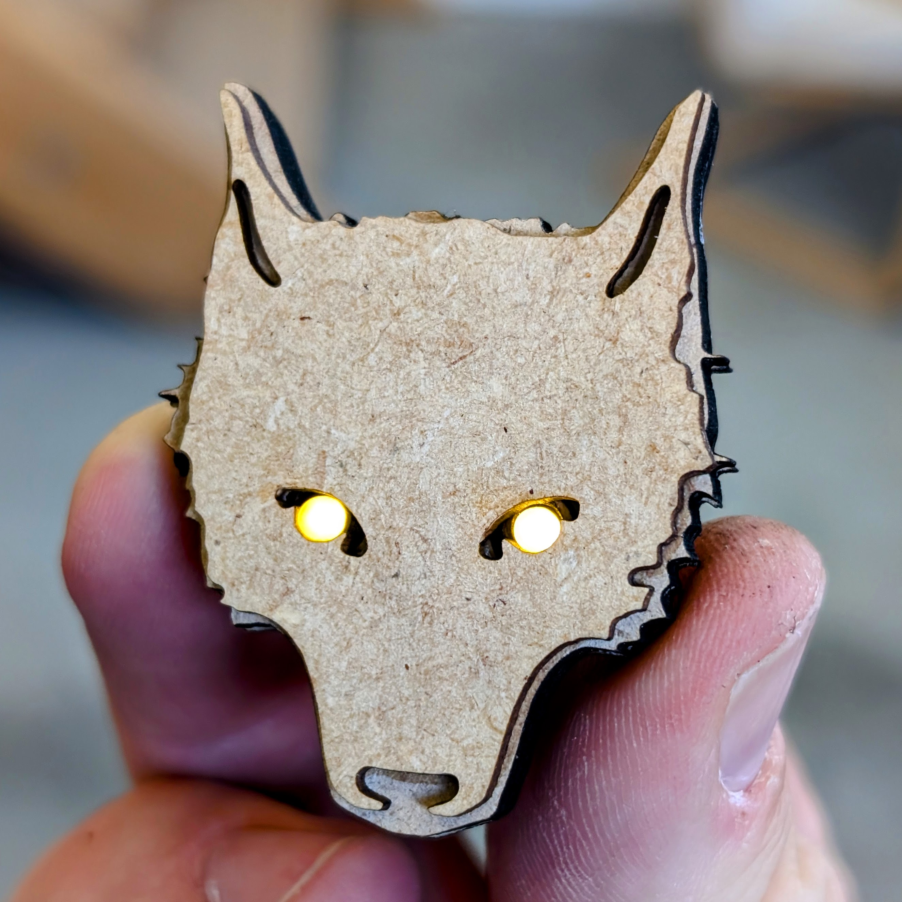

# LED Wolf

This great LED wolf is a good way to start tinkering if you don't have a soldering iron with you at the moment. All you need is a little glue and a small Phillips screwdriver to assemble this great wolf. Then the wolf lights up with its great yellow eyes! The CR2032 battery is securely screwed together with a bar. 

 

- Status: **Complete**
- Difficulty: **1/5**

### Parts List

| Description                   | Quantity |
|-------------------------------|----------|
| wooden parts 3mm              |     2    |
| wooden part 1.6mm             |     1    |
| wooden bar 1.6mm				|	  1	   |
| eye rings 					|	  2	   |
| LED 3mm yellow/orange			|	  2	   |
| wood screw M1,4x5mm			|	  2	   |
| CR2032 Battery (not included) |     1    |

### Copyright and Authorship

- Board: [CC-0](https://creativecommons.org/publicdomain/zero/1.0/) - [Jonathan Günz (harmoniemand)](https://www.thingiverse.com/harmoniemand/designs)

### Buy Soldering Kits
If you want to buy the parts for this kit you can find everything here: [LEDWolf - shop.blinkyparts.com](https://shop.blinkyparts.com/de/LED-Wolf-Holzbausatz-ohne-Loeten/blink23105)
