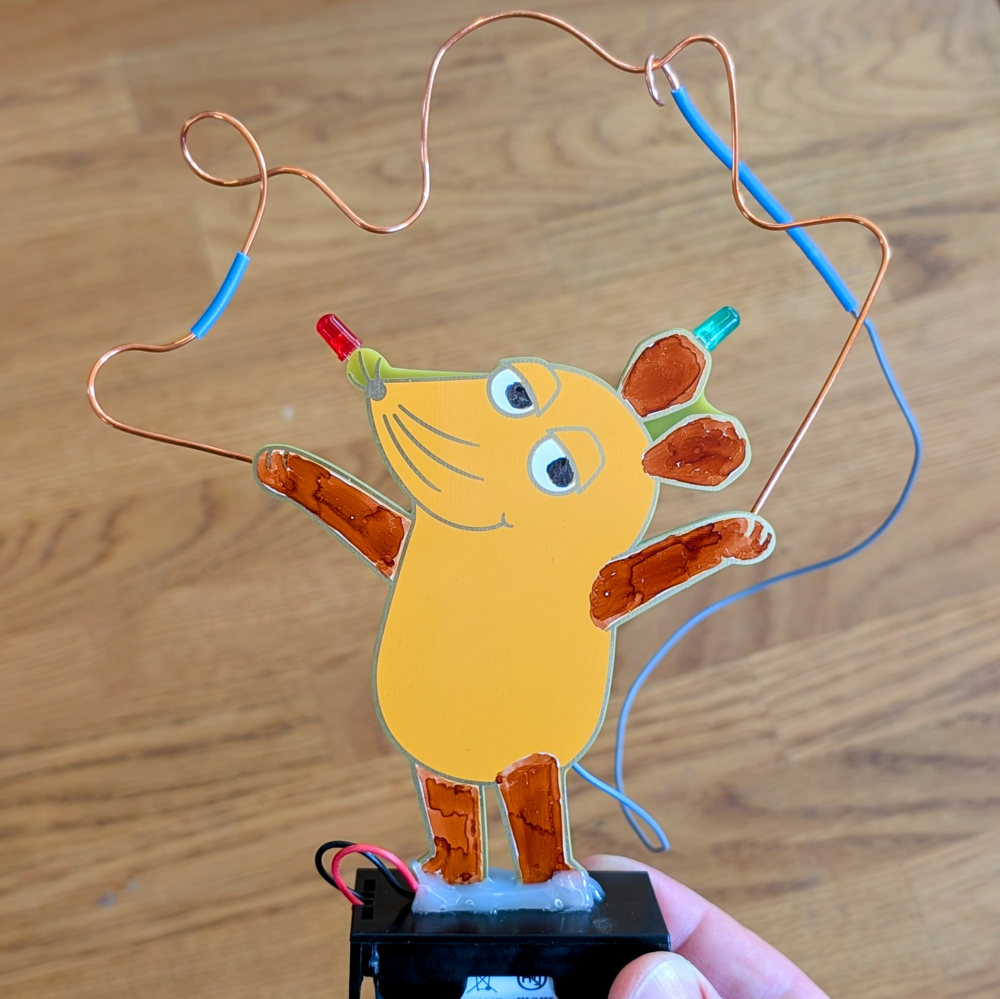
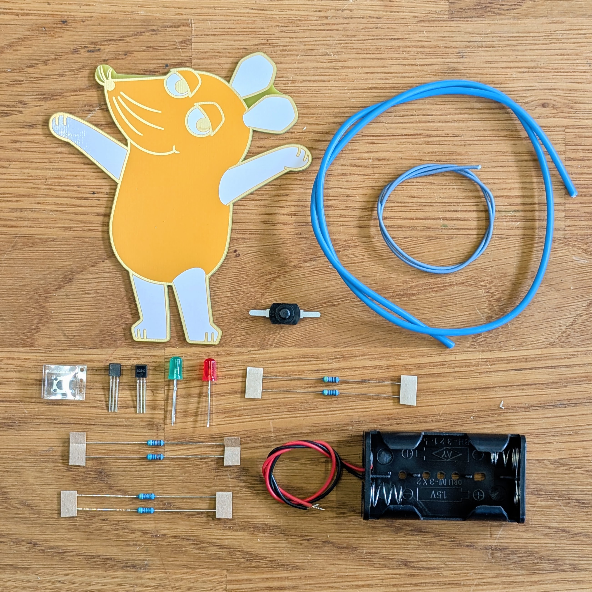

# Die Sendung mit der Maus - Maus

Everyone knows the great Mouse from the “Sendung mit der Maus” and, as always, wants to play a lot. This soldering kit is a hot wire and you can proof your steady hand!

 

- Status: **Complete**
- Difficulty: **2/5**

### Parts List

| Quantity | Name(s)       | Description                 | Label / Color Code                          |
|----------|---------------|-----------------------------|---------------------------------------------|
| 2        | Q1, Q2        | Transistor BC547            | BC547                                       |
| 1        | D1            | LED 5 mm green              |                                             |
| 1        | D2            | LED 5 mm red                |                                             |
| 2        | R1, R2        | Resistor 430 Ω              | Yellow · Orange · Black · Black · Brown     |
| 2        | R3, R4        | Resistor 4.7 kΩ             | Yellow · Violet · Black · Brown · Brown     |
| 2        | R5, R6        | Resistor 47 kΩ              | Yellow · Violet · Black · Red · Brown       |
| 1        | SW1           | Switch                      |                                             |
| 1        | SW2           | Pushbutton                  |                                             |
| 1        | –             | Rigid cable (approx. 50 cm) |                                             |
| 1        | –             | Flexible cable (approx. 30 cm) |                                          |
| 1        | –             | Printed circuit board (PCB) |                                             |
| 1        | –             | Battery holder for AA cells |                                             |
| 2        | –             | AA (Mignon) batteries       | *(not included)*                            |

### Copyright and Authorship

- Graphic: Copyright belongs to WDR - Attention not usable without permission.
- Board: [CC-BY-NC-SA 4.0](https://creativecommons.org/licenses/by-nc-sa/4.0/) - Timo Schindler @ [blinkyparts.com](https://shop.blinkyparts.com)

### Buy Soldering Kits
Unfortunately, you can't just buy this great elephant. We are only allowed to give the elephants to organizations that take part in the “Türen auf mit der Maus” day. Are you one of these organizations? Please get in touch with us: [shop.blinkyparts.com](https://shop.blinkyparts.com/)
