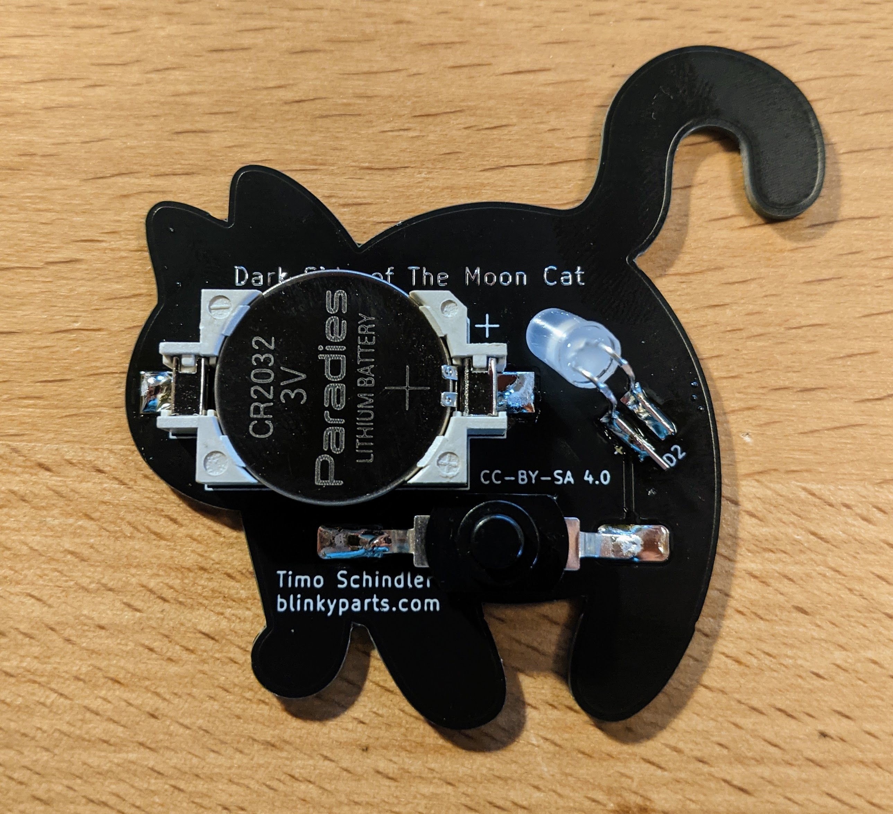

# Moon Cat

Excuse me? What are you staring at?
This wonderful kit is very simple in terms of circuitry, but the result is simply hilarious. A cat from behind.. And what is that? The as... shines ... in rainbow colours!

 

- Status: **Complete**
- Difficulty: **2/5**

### Parts List

| Description                   | Quantity |
|-------------------------------|----------|
| RGB LED  5mm                  |     1    |
| Button (SMD)                  |     1    |
| CR2032 Battery Holder (SMD)   |     1    |
| CR2032 Battery (not included) |     1    |

### Copyright and Authorship

- Board: [CC-BY-SA 4.0](https://creativecommons.org/licenses/by-sa/4.0/) - Timo Schindler
- Unicorn SVG [CC-BY-SA](https://creativecommons.org/licenses/by-sa/4.0/) - [Cat Butt By Denis Sazhin from the Noun Project](https://thenounproject.com/iconka/collection/cat-power/?i=1179228) (We've bought a licence, you should honor the artist work too!)

### Buy Soldering Kits
If you want to buy the parts and PCB for a soldering kit you can find everything here: [shop.blinkyparts.com](https://shop.blinkyparts.com/en/Dark-Side-of-the-Moon...-Cat-wonderful-simple-kit-to-solder-and-love-Please-don-t-stare/blink233042)
