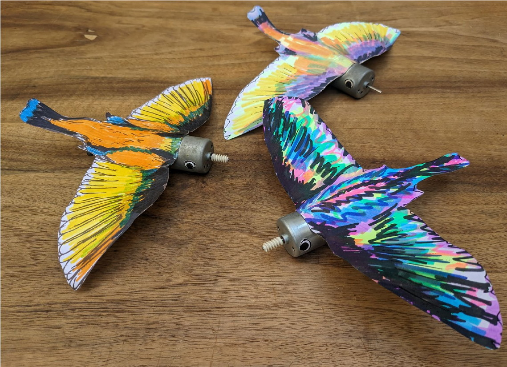
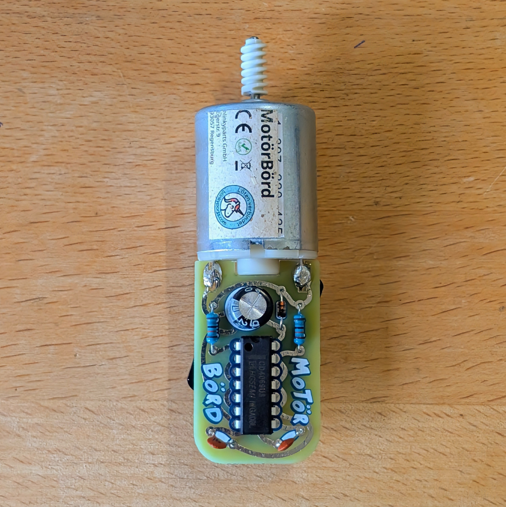

# Motörbörd - The electronic chirping bird you can build yourself

Chirp chirp chirp, chirp chirp! The Motörbörd is a creative soldering kit that you can use to build your own little bird call generator. It is not powered by batteries, but by a small motor that generates electrical energy when turned like a dynamo.

 

- Status: **Complete**
- Difficulty: **2/5**

### Parts List

| Quantity | Description                                 | Labeling/color code                      |
|----------|---------------------------------------------|------------------------------------------|
|          |                                             |                                          |
| 1        | Electrolytic capacitor 470uF |                                          |
| 2        | Resistor 180kOhm                | Braun \| Grau \| Schwarz \| Orange \| Gold |
| 1        | Ceramic capacitor 330pF     | 331                                      |
| 1        | Motör                                       |                                          |
| 1        | Diode                                       |                                          |
| 1        | CD4069                                      |                                          |
| 1        | Speaker                                     |                                          |
| 1        | MotörBörd sticker                           |                                          |
| 1        | MotörBörd circuit board (PCB)               |                                          |
| 1        | Instructions with wing                      |                                          |

### Copyright and Authorship

- Board: [CC-BY-SA 4.0](https://creativecommons.org/licenses/by-sa/4.0/) - [noisio.de](https://www.noisio.de)

### Buy Soldering Kits
If you want to buy the parts and PCB for a soldering kit you can find everything here: [shop.blinkyparts.com](https://shop.blinkyparts.com/de/Motoerboerd-Ein-elektronischer-Zwitschervogel/blink23143)
