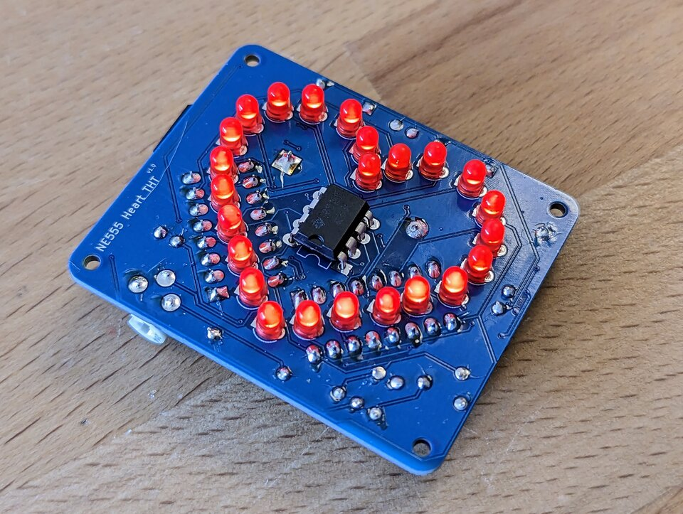

# NE555 Heart - THT
Small soldering kit with an heart on it from driven by a NE555.

- Status: **Complete**
- Difficulty: **3/5**

### Parts List

| Description                   |  Name  | Quantity |
|-------------------------------|:------:|:--------:|
| LED 3mm red	                | D3-D26 |    24    |
| Capacitor 10nF            	|   C1   |     1    |
| Capacitor 100n            	|  C3-C5 |     3    |
| Capacitor 1uF			|   C2	 |     1    |
| Diode 1N4007              	|  D1-D2 |     2    |
| Resistor 1k          		|   R1   |     1    |
| Resistor 100k        		|   R2   |     1    |
| Resistor 47R         		|   R3   |     1    |
| Resistor Variable   		|   RV1  |     1    |
| Switch	   		|   SW2  |     1    |
| Push Button	   		|   SW1  |     1    |
| NE555                  	|   U1   |     1    |
| CD4017                 	|  U2-U3 |     2    |
| CR2032 Battery Holder (THT)   |  BT1   |     1    |
| CR2032 Battery (not included) |        |     1    |

### Manual
You can find the manual and pictures of every step in the manual folder.

### Copyright and Authorship

- Board: [CC-BY-NC-SA 4.0](https://creativecommons.org/licenses/by-nc-sa/4.0/) - Timo Schindler @ [blinkyparts.com](https://shop.blinkyparts.com)
- Manual (TeX): [LPPL](https://www.latex-project.org/lppl.txt) - [Marei Peischl](https://peitex.de)
- Manual (pdf): [CC-BY-SA 4.0](https://creativecommons.org/licenses/by-sa/4.0/) - [Binary Kitchen e.V.](https://www.binary-kitchen.de)
