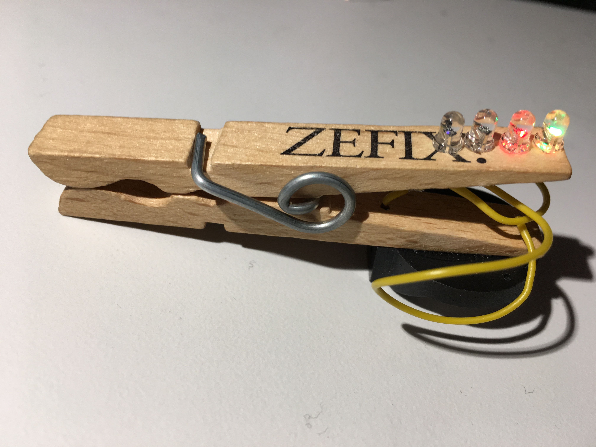

# Nibble Peg - DIP
A very easy blinking peg with 4 LEDs.
A Nibble ist a unit for the amount of 4 Bits (https://en.wikipedia.org/wiki/Nibble).

- Status: **Complete**
- Difficulty: **1/5**

### Parts List

| Menge | Name            | Beschreibung                       | Beschriftung/Farbcode |
|-------|-----------------|------------------------------------|-----------------------|
| 1     | Peg             | Wooden Peg		               |                       |
| 1     | Battery Holder  | CR2032 Battery Holder	       |                       |
| 1     | Battery CR2032  |                                    |                       |
| 4     | LED             | 3mm RGB flashing LED               |                       |
| 2     | Cable           |                                    |                       |

### Manual
You can find the manual and pictures of every step in the manual folder.

### Copyright
CC-BY-SA 4.0 - Timo Schindler
