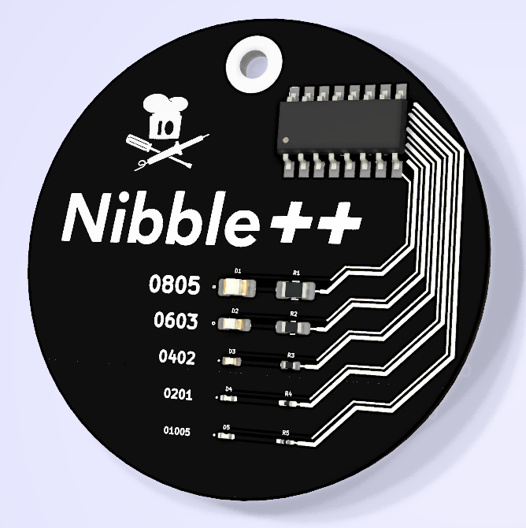

# Nibble++ SMD Challenge
A simple PCB to test your SMD hand-soldering skills. Going down to sand grain sized 01005 SMD parts, this button is a challenge for experienced "soldiers" and those who want to become one.

- Status: **Complete**
- Difficulty: **6/5**

### Parts List

| Designator |       Package      | Quantity |   Designation   |  (Color)-Code              |
|:----------:|:------------------:|----------|:---------------:|:---------------------------:
| BT1        | SMD Battery Holder | 1        | CR2023          |                            |
| C1         | 0805 SMD Capacitor | 1        | 100n F          | red, white package         |
| C2         | 0805 SMD Capacitor | 1        | 1µ F            | blue, transparent package  |
| C3         | 0805 SMD Capacitor | 1        | 100n F          | red, white package         |
| D1         | 0805 SMD LED       | 1        | LED Red         | none, black package        |
| D2         | 0603 SMD LED       | 1        | LED Orange      | red, black package         |
| D3         | 0402 SMD LED       | 1        | LED Yellow      | yellow, black package      |
| D4         | 0201 SMD LED       | 1        | LED Green       | green, black package       |
| D5         | 0201 SMD LED       | 1        | LED Blue        | blue, black package        |
| R1         | 0805 SMD Resistor  | 1        |  82 Ohm         | 820                        |
| R2         | 0603 SMD Resistor  | 1        |  82 Ohm         | red, white package         |
| R3         | 0402  SMD Resistor | 1        |  62 Ohm         | yellow, white package      |
| R4         | 0201 SMD Resistor  | 1        | 330 Ohm         | green, white package       |
| R5         | 01005 SMD Resistor | 1        |  33 Ohm         | blue, white package        |
| R6,R7      | 0805 SMD Resistor  | 2        | 100k Ohm        | 104 <- im Päckchen sind andere Widerstände                   |
| SW1        | SMD Switch         | 1        |                 |                            |
| U1         | SOIC-8 NE555       | 1        |                 |                            |
| U2         | SOP-16 CD4017      | 1        |                 |                            |

### Manual
You can find the manual and pictures of every step in the manual folder.

## Name
The name Nibble++ origins from a simple [nibble peg](https://github.com/Binary-Kitchen/SolderingTutorial/tree/master/NibblePegDIP) which has been developed one year earlier. A Nibble is a unit for the amount of 4 bits (https://en.wikipedia.org/wiki/Nibble). Because we are using five LEDs we incremented the value ;).

## PCB Layout
The PCB-Layout can be found on Github: https://github.com/Binary-Kitchen/nibble_plusplus

## Copyright and Authorship
- Idea: [CC-BY-SA 3.0](https://creativecommons.org/licenses/by-sa/3.0/) - [Ken Olsen (www.MakersBox.us)](https://github.com/aspro648/KiCad/tree/master/projects/Attiny/Attiny85Challenge)
- PCB-Layout: [CC-BY-SA 3.0](https://creativecommons.org/licenses/by-sa/3.0/) - [Ken Olsen](http://www.MakersBox.us), [Thomas Schmid and Timo Schindler](https://www.binary-kitchen.de)
- Manual (TeX): [LPPL](https://www.latex-project.org/lppl.txt) - [Marei Peischl](https://peitex.de)
- Manual (pdf): [CC-BY-SA 4.0](https://creativecommons.org/licenses/by-sa/4.0/) - [Binary Kitchen e.V.](https://www.binary-kitchen.de)
