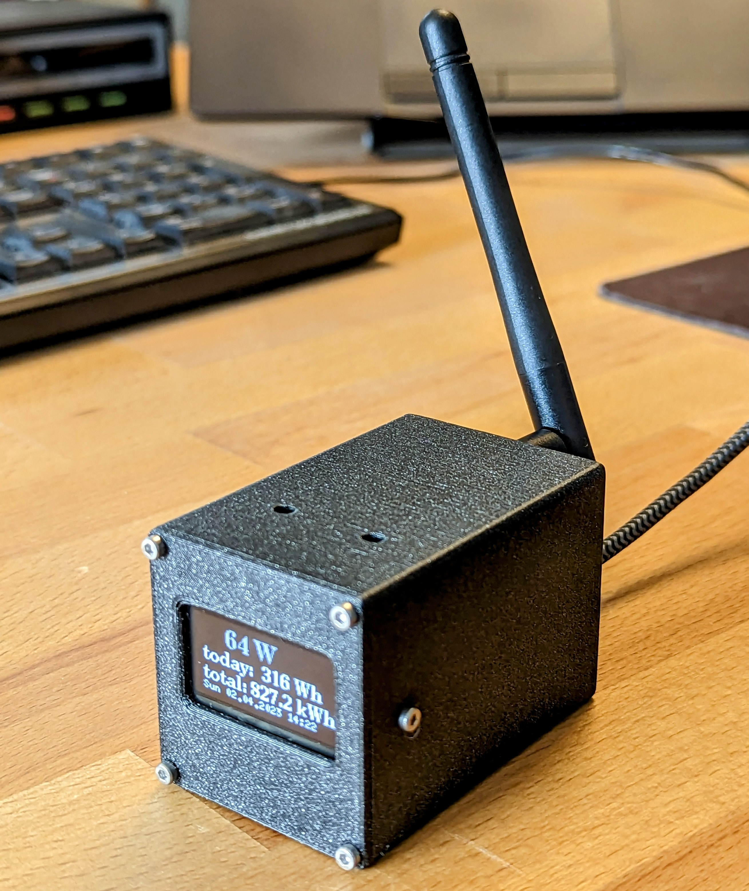

# OpenDTU Breakout Board
A board to get information from your solar power panels with an Hoymiles inverter.

- Status: **Complete**
- Difficulty: **2/5**

### Parts List

| Quantity | Name | Description | Label/Color Code |
|----------|------|-------------|------------------|
| 1     | U1   | ESP32       | ESP32-WROOM32         |
| 1     | U2   | Wireless module   | ML01DP5               |
| 1	|	| Display | SH1106 |
| 2     | D1,D2 | 3mm green LED |                      |
| 1     | C1   | 10µF capacitor |                      |
| 2     | C2   | 100nF ceramic capacitor | 104                |
| 1     | J1   | 4x L-shaped pin header |                      |
| 2     | U1   | 1x19 pin female header |                      |
| 1     |      | 4-way cable |                      |
| 1     | R1,R2 | 68Ω resistor |  |
| 1     | R3   | 390Ω resistor |  |
| 1     |      | PCB (Printed Circuit Board) |                      |
| 6     |      | Optional: M2x6 screw |                      |
| 2     |      | Optional: 3D-printed case parts |                      |
| 2     |      | Not included: Toothpick |                      |
| 1     |      | Not included: Micro-USB cable |                      |

### Manual
You can find the manual and pictures of every step in the manual folder.

### Copyright and Authorship

- Board: [CC-BY-NC-SA 4.0](https://creativecommons.org/licenses/by-nc-sa/4.0/) - Timo Schindler @ [blinkyparts.com](https://shop.blinkyparts.com)
- Code: [GPLv2](https://www.gnu.org/licenses/old-licenses/gpl-2.0.html) - [tbnobody](https://github.com/tbnobody/OpenDTU)
- Manual (TeX): [LPPL](https://www.latex-project.org/lppl.txt) - [Marei Peischl](https://peitex.de)
- Manual (pdf): [CC-BY-SA 4.0](https://creativecommons.org/licenses/by-sa/4.0/) - [Binary Kitchen e.V.](https://www.binary-kitchen.de)
