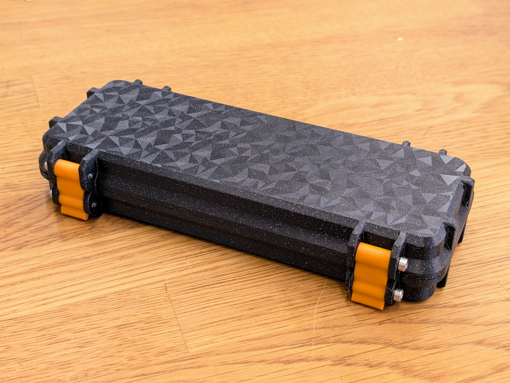

# Pinecil Case

A perfect 3D-printed rugged case for your pinecil, extra tips and usb-c cable.

 

- Status: **Complete**
- Difficulty: **1/5**

### Parts List

| Quantity | Description                    	   |
| -------- | ------------------------------------- |
| 2        | Outer Case (black)           		   |
| 2        | Inner Case (orange)          		   |
| 1        | Brass wool                   		   |
| 2        | Clips                        		   |
| 1        | Bearing                     		   |
| 1        | Soldering iron holder       		   |
| 4        | Coil parts                  		   |
| 1        | M3x16 screw                 		   |
| 6        | M3x20 screw               		       |
| 1        | M3 nut                      		   |
| 4		   | 5x1mm round neodym magnet			   |
| 8		   | 4x2mm round neodym magnet			   |
| 1		   | 6x2mm round neodym magnet			   |
| 1        | Superglue (not included)              |
| 1        | Pinecil Soldering Iron (not included) |
| 1        | Pinecil USB-C cable (not included)    |
| 2        | Soldering tips (not included)         |
| 1        | Solder (not included)                 |

### Copyright and Authorship

- Rugged Multipart Pinecil/TS100/TS80 Case (V2): [CC-BY-NC-SA 4.0](https://creativecommons.org/licenses/by-nc-sa/4.0/) - [PjotrStrong](https://www.printables.com/de/model/345083-rugged-multipart-pinecil-case)
- Pinecil, TS100, TS101, TS80 & TS80p Case: [CC-BY-NC-SA 4.0](https://creativecommons.org/licenses/by-nc-sa/4.0/) - [Termiman](https://www.printables.com/de/model/237958-ts100-pinecil-ts80-ts80p-case-with-options-stand-s)
- Rugged Box (Parametric): [CC-BY-NC-SA 4.0](https://creativecommons.org/licenses/by-nc-sa/4.0/) - [Whity](https://www.printables.com/de/model/258431-rugged-box-parametric)

### Buy Pinecil Case
If you want to buy the parts and case for this kit you can find everything here: [Pinecil Case @ shop.blinkyparts.com](https://shop.blinkyparts.com/de/Robuster-Case-Bausatz-fuer-den-Pinecil-Alles-sauber-und-perfekt-verpackt/blink237442)
