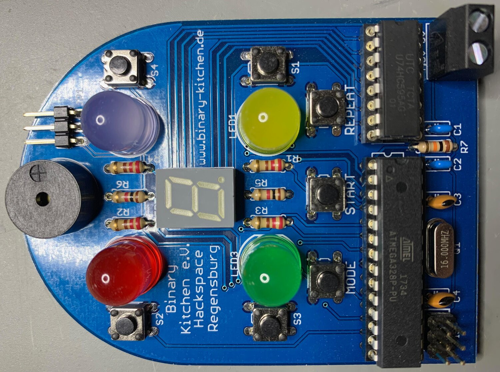

# Push-It DIP
Simon Says clone with (optional) multiplayer mode

- Status: **Development**
- Difficulty: **2/5**

### Parts List

| Quantity | Name    | Description                        | Signing/Colorcode             |
|----------|---------|------------------------------------|-------------------------------|
| 4        | R1 - R4 | Resistor 220 Ohm                   | red - red - brown - gold      |
| 2        | R5, R6  | Resistor 1 Kilo Ohm                | brown - black - red - gold    |
| 1        | R7      | Resistor 10 Kilo Ohm               | brown - black - orange - gold |
| 7        | S1 - S7 | Button                             |                               |
| 1        | SG1     | Speaker                            |                               |
| 1        | JP1     | Pinheader 3x1                      |                               |
| 1        | LED1    | LED 10mm Yellow                    |                               |
| 1        | LED2    | LED 10mm Red                       |                               |
| 1        | LED3    | LED 10mm Green                     |                               |
| 1        | LED4    | LED 10mm Blue                      |                               |
| 1        | LED7    | 7-Segment Display (SA39-11SRWA)    |                               |
| 2        | C1, C2  | Ceramic capacitor 100 nF           | 104                           |
| 2        | C3, C4  | Ceramic capacitor 22 pF            | 22                            |
| 1        | IC1     | 74HC 595                           |                               |
| 1        | IC2     | Mikrocontroller Atmel Atmega 328P  |                               |
| 1        | Q1      | 16MHz Oscillator                   |                               |
| 1        | POWER   | Screw TConnector 2-pin             |                               |
| 1        |         | IC-Socket 16-pin                   |                               |
| 1        |         | IC-Socket 28-pin                   |                               |
| 1        |         | Circuit Board (PCB)                |                               |
| 1        |         | Battery Case                       |                               |
| 4        |         | Battery Mignon (AA)                |                               |

### Manual
You can find the manual and pictures of every step in the manual folder.

### Copyright and Authorship
- Board: [CC-BY-SA 4.0](https://creativecommons.org/licenses/by-sa/4.0/) - Thomas Basler
- Manual (TeX): [LPPL](https://www.latex-project.org/lppl.txt) - [Marei Peischl](https://peitex.de)
- Manual (pdf): [CC-BY-SA 4.0](https://creativecommons.org/licenses/by-sa/4.0/) - [Binary Kitchen e.V.](https://www.binary-kitchen.de)