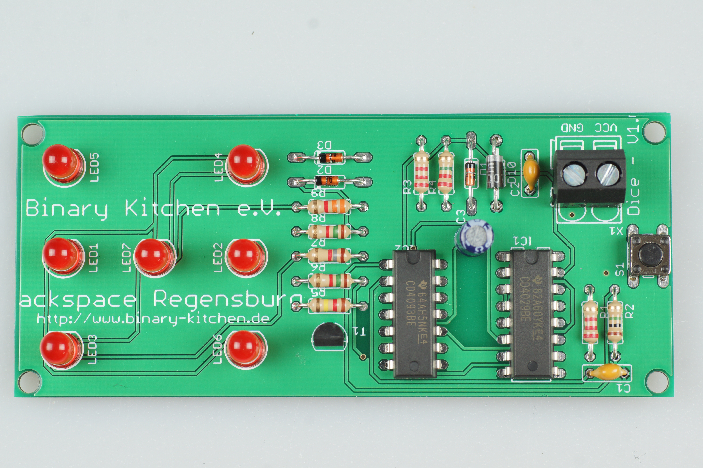
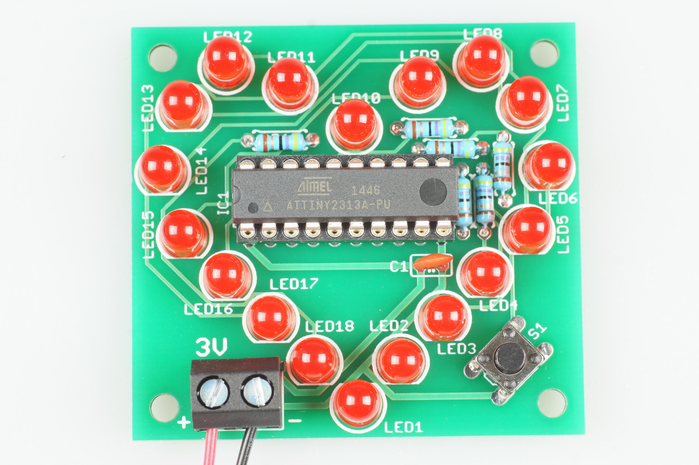
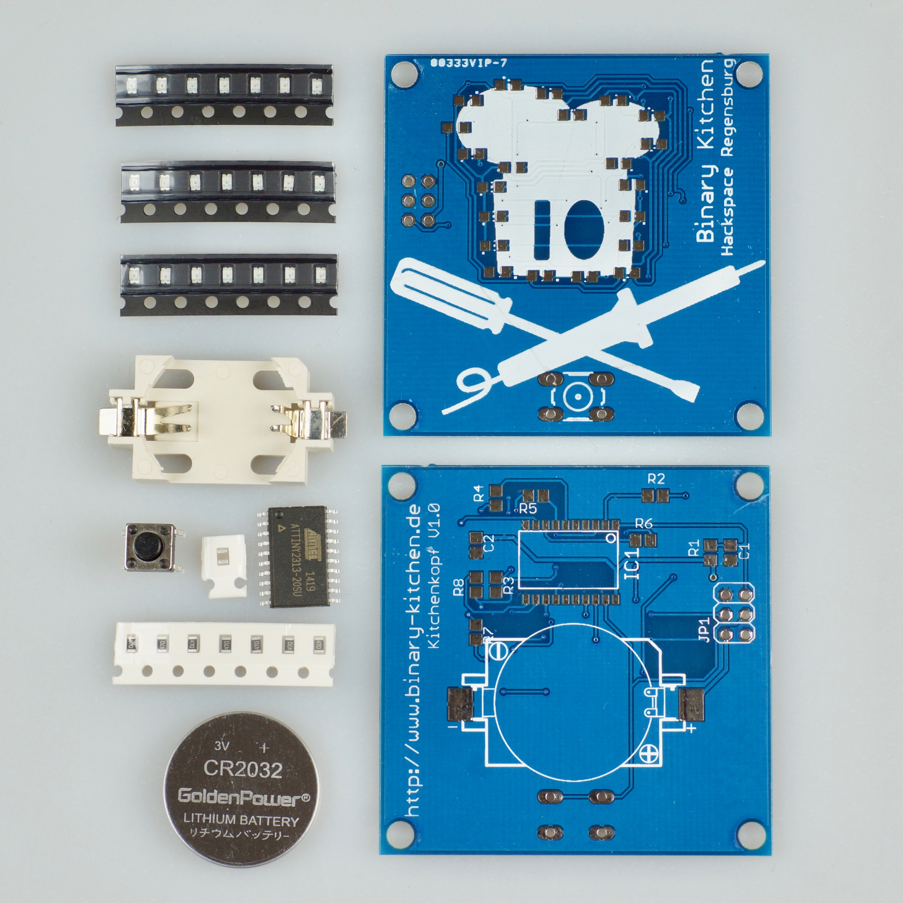

# Soldering Tutorial
This repository contains all files for our soldering kits and courses. Please feel free to download and use everything you need.

We've tried to collect and create tutorials with different difficulties and are offering SMD and DIP soldering kits.

## Soldering Kits

### [Arrow SMD](ArrowSMD/) 
Small soldering kit with an arrow on it from https://wiki.blinkenarea.org/index.php/AntiKippenLights-Mini.

- Status: **Complete**
- Difficulty: **4/5**

### [Dice DIP](DiceDIP/) 
Electronic dice which uses button bouncing and timing for randomness.

- Status: **Complete**
- Difficulty: **3/5**

### [Heart DIP](HeartDIP/) 
Small soldering kit with an heart on from https://wiki.blinkenarea.org/index.php/AntiKippenLights-Atmel

- Status: **Complete**
- Difficulty: **2/5**

### [Heart SMD](HeartSMD/) 
Small soldering kit with an heart on it from http://wiki.blinkenarea.org/index.php/AKL-Mini

- Status: **Complete**
- Difficulty: **4/5**

### [I Can Solder DIP](ICanSolderDIP/)
Very easy soldering kit for using it as pin.

- Status: **Manual and pictures missing**
- Difficulty: **1/5**

### [Kitchen Head DIP](KitchenHeadDIP/)
Small soldering kit with the kitchen head on it.

- Status: **In development**
- Difficulty: **3/5**

### [Kiten Head SMD](KitchenHeadSMD/) 
Small soldering kit using SMD components with the kitchen head on it.

- Status: **Complete**
- Difficulty: **4/5**

## License
This work is licensed under different licenses. Please see subfolders for details and COPYING file in the top level directory for all used license files.

## Copyright

Copyright (c) Arne Rossius, 2009
Copyright (c) Binary Kitchen e.V., 2017

## Authors

Boards:
- Arne Rossius <arne@blinkenarea.org>
- Thomas Basler <noby@binary-kitchen.de>

Comic:
- Mitch Altmann <http://cornfieldelectronics.com>
- Jeff Keyzer <http://mightyohm.com/blog/>
- Andie Nordgren <andie.nordgren@gmail.com>

Manuals:
- Marei Peischl <kontakt@peitex.de>
- Michael Pajewski
- Timo Schindler <https://www.timoschindler.de>
