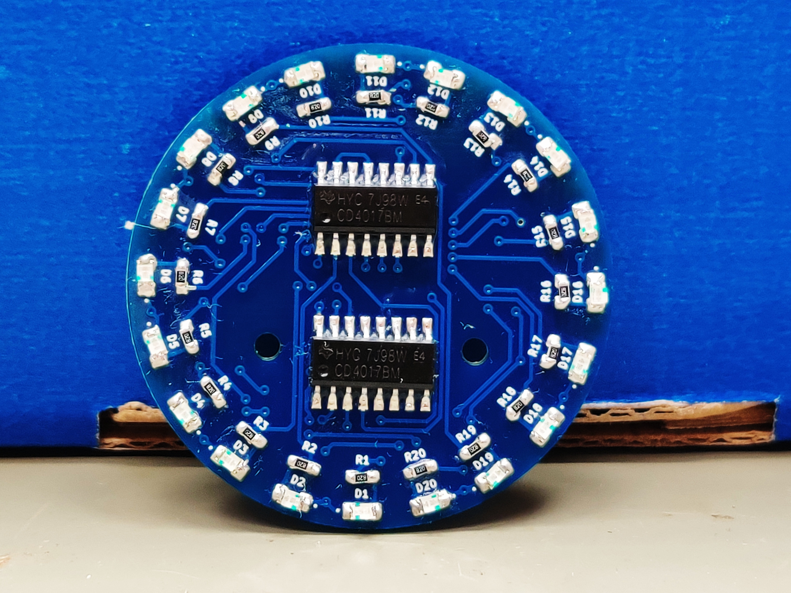

# Ring Light
The running light is achieved by a circuit of a clockgenerator NE555 (U1) and two shift registers TI4017 (U2, U3). The NE555 uses the clock signal to shift one bit through both shift registers. At the end the circuit is reset and the cycle starts anew. The outputs of U2 controls the 20 LEDs (D1-D20). Since the TI4017 only has 10 outputs, one output controls  two LEDs. U3 controls one transistor each (Q1, Q2) using two outputs, which alternately pull D1-D10 or D11-D20 to GND. This process repeats itself.

- Status: **Complete**
- Difficulty: **4/5**

### Parts List

| Pos.|References   	| Value       		| Quantity    | 
| --- | --------------- | --------------------- | ----------- |
|1    | C1, C2      	| 100n F       		| 2           | 
|2    |	C           	| 1µ F         		| 1           |
|3    | R1-R20      	| 82 Ohm      		| 20          |
|4    | R21, R22    	| 100k Ohm    		| 2           |
|5    | R23, R24    	| 1k Ohm      		| 2           |
|6    | D1-D20      	| LED          		| 20          |
|7    | U1          	| NE555       		| 1           |
|8    | U2, U3      	| TI4017      		| 2           |
|9    | SW1         	| SW_DPDT_x2  		| 1           |
|10   | Q1, Q2     	| BC850        		| 2           |
|12   | Battery Holder	| Battery_Holder	| 1           |
|13   | Battery     	| CR2032      		| 1           |
|14   | PCB         	| SMD-Lauflicht		| 1           |

### Manual
You can find the manual and pictures of every step in the manual folder.

## PCB Layout
The PCB-Layout can be found on Github: tbd

## Video
A video of the running PCB can be found here: [YouTube](https://youtu.be/Xx-zP-Ia8_w)

## Copyright and Authorship
- PCB-Layout: [CC-BY-SA 4.0](https://creativecommons.org/licenses/by-sa/4.0/) - [Taxxizz](https://twitter.com/Taxxizz)
- Manual (TeX): [LPPL](https://www.latex-project.org/lppl.txt) - [Marei Peischl](https://peitex.de)
- Manual (pdf): [CC-BY-SA 4.0](https://creativecommons.org/licenses/by-sa/4.0/) - [Binary Kitchen e.V.](https://www.binary-kitchen.de)

### Buy Soldering Kits
If you want to buy the parts and PCB for a soldering kit you can find everything here: [shop.blinkyparts.com - Running Light](https://shop.blinkyparts.com/en/SMD-running-light-Soldering-kit-for-the-proper-learning-of-soldering-SMD-components/blink233142)
