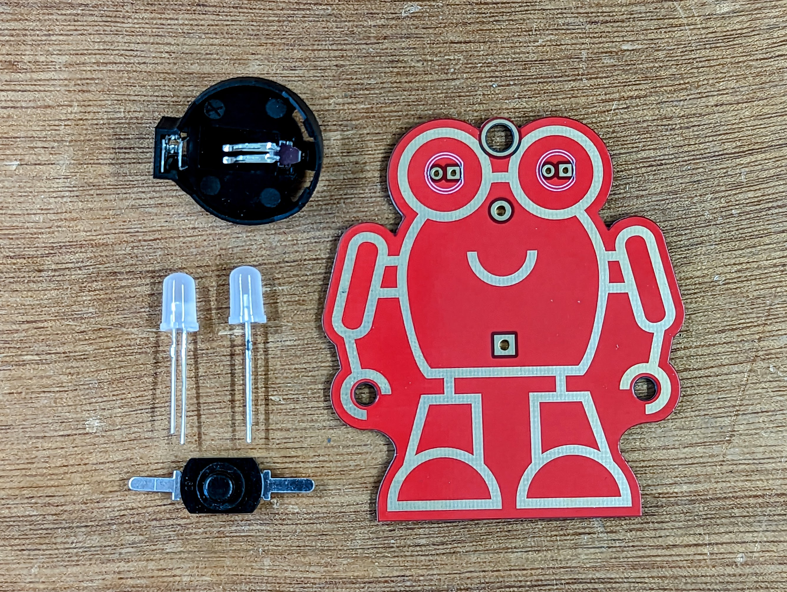

# Robo Robin

Light up this super easy Robot. It has RGB-LEDs as eyees.

 

- Status: **Complete**
- Difficulty: **1/5**

### Parts List

| Description                   | Quantity |
|-------------------------------|----------|
| RGB LEDs 5mm                  |     2    |
| Button (SMD)                  |     1    |
| CR2032 Battery Holder (SMD)   |     1    |
| CR2032 Battery (not included) |     1    |
| Robot Board (PCB)		|     1    |

### Copyright and Authorship

- Board: [CC-BY-SA 4.0](https://creativecommons.org/licenses/by-sa/4.0/) - Timo Schindler @ [blinkyparts.com](https://shop.blinkyparts.com)
- Al Hacka Alpaca [CC-BY-SA](https://creativecommons.org/licenses/by-sa/4.0/) - iconcheese on [thenounproject.com](https://thenounproject.com/icon/robot-1159392/) (We've bought a licence, you should too!)

### Buy Soldering Kits
If you want to buy the parts and PCB for a soldering kit you can find everything here: [shop.blinkyparts.com](https://shop.blinkyparts.com/de/Das-Jugendhackt-Al-Hacka-Cooler-als-die-Realtitaet-erlaubt/blink238742)
