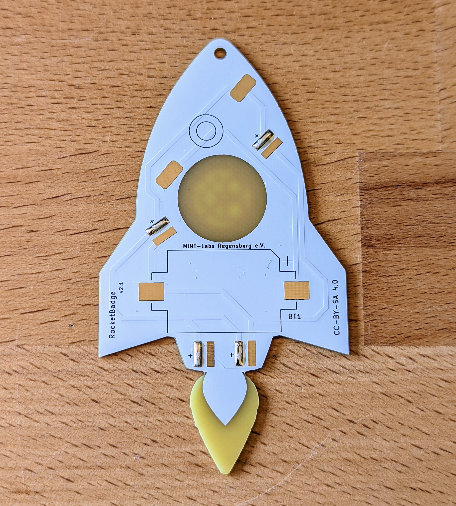

# Rainbow Rocket

Launch your own rocket! With the MINT-Labs rocket soldering kit you can make a beautiful glowing necklace. Once soldered, the porthole and the exhaust jet, the tail of the rocket will glow in all the colours of the rainbow.

 

The RGB-Effect looks like this, but much better in real :)

- Status: **Complete**
- Difficulty: **2/5**

### Parts List

| Description                   | Quantity |
|-------------------------------|----------|
| RGB LEDs 5mm                  |     4    |
| Button (SMD)                  |     1    |
| CR2032 Battery Holder (SMD)   |     1    |
| CR2032 Battery (not included) |     1    |

### Copyright and Authorship

- Board: [CC-BY-SA 4.0](https://creativecommons.org/licenses/by-sa/4.0/) - Timo Schindler @ blinkyparts.com
- Unicorn SVG [CC-BY-SA](https://creativecommons.org/licenses/by-sa/4.0/) - [Rocket by Jean-Philippe Cabaroc from the Noun Project](https://thenounproject.com/icon/rocket-7427/) (We've bought a licence, you should honor the artist work too!)

### Buy Soldering Kits
If you want to buy the parts and PCB for a soldering kit you can find everything here: [shop.blinkyparts.com](https://shop.blinkyparts.com/en/Rainbow-Rocket-A-soldering-kit-out-of-this-world/blink234942)
