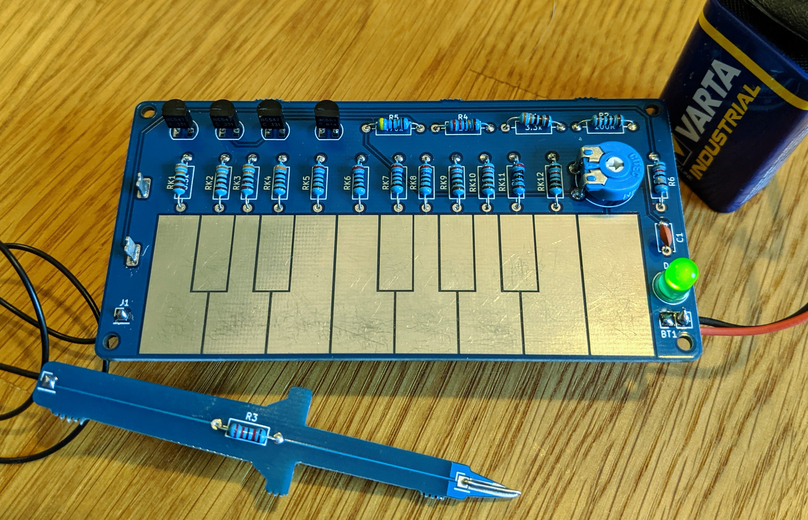
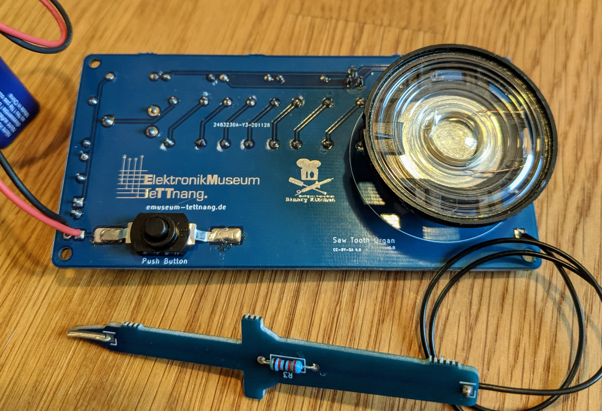

# Saw Tooth Organ - DIP

Some Transistors creating a saw tooth wave enabling a very simple organ which you can play.

 

- Status: **Complete**
- Difficulty: **2/5**

### Parts List

| Quantity | Name        | Description           | Signing/Colorcode                |
| -------- | ----------- | --------------------- | -------------------------------- |
| 1        | BT1         | 9V battery connector  |                                  |
| 1        | C1          | 22nF capacitor        | 223                              |
| 1        | D1          | green 5mm LED         |                                  |
| 1        | LS1         | 8-100 Ohm speaker*    |                                  |
| 3        | Q1-Q3       | BC547C NPN transistor |                                  |
| 1        | Q4          | BC557C PNP transistor |                                  |
| 4        | R1, RK1-RK3 | 3.3k Ohm resistor 1%  | orange-orange-black-brown-brown  |
| 1        | R2          | 100 Ohm resistor 1%   | brown-black-black-black-brown    |
| 1        | R3          | 22k Ohm resistor 1%   | red-red-black-red-brown          |
| 1        | R4          | 220k Ohm resistor 1%  | red-red-black-orange-brown       |
| 1        | R5          | 470k Ohm resistor 1%  | yellow-violet-black-orange-brown |
| 1        | R6\*         | 82 Ohm resistor 1%   | grey-red-black-gold-brown        |
| 1        | RK4         | 3k Ohm resistor 1%    | orange-black-black-brown-brown   |
| 4        | RK5-RK8     | 2.7k Ohm resistor 1%  | red-violet-black-brown-brown     |
| 1        | RK9,RK10    | 2.2k Ohm resistor 1%  | red-red-black-brown-brown        |
| 1        | RK11        | 2k Ohm resistor 1%    | red-black-black-brown-brown      |
| 1        | RK12        | 1.2k Ohm resistor 1%  | brown-red-black-brown-brown      |
| 1        | RV6         | 25k Ohm potentiometer |                                  |
| 1        | SW1         | push button           |                                  |
| 1        |             | wire flexible         | ~30cm flexible wire              |
| 1        |             | wire stiff            | ~3cm stiff wire                  |
| 1        |             | PCB                   |                                  |

\*You have to adjust R6 for the Speaker. 82 Ohm suits for 8 Ohm to 50 Ohm speaker. A 100 Ohm speaker needs 0 Ohm.

### Manual
You can find the manual and pictures of every step here: https://github.com/Binary-Kitchen/SolderingTutorial

### Copyright and Authorship

- Board: [CC-BY-SA 4.0](https://creativecommons.org/licenses/by-sa/4.0/) - Timo Schindler
- Idea and scheme: [CC-BY-SA 4.0](https://creativecommons.org/licenses/by-sa/4.0/) - [Elektronikmuseum Tettnang](http://www.emuseum-tettnang.de/)
