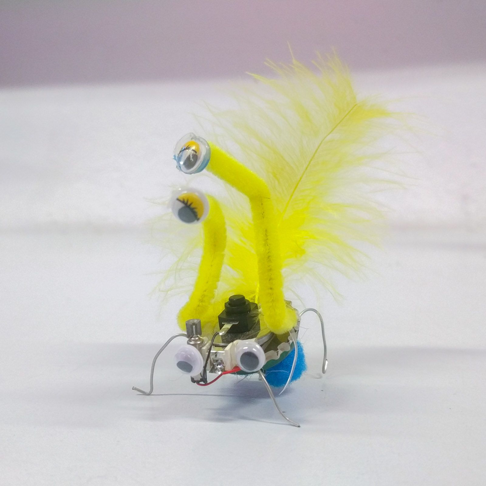
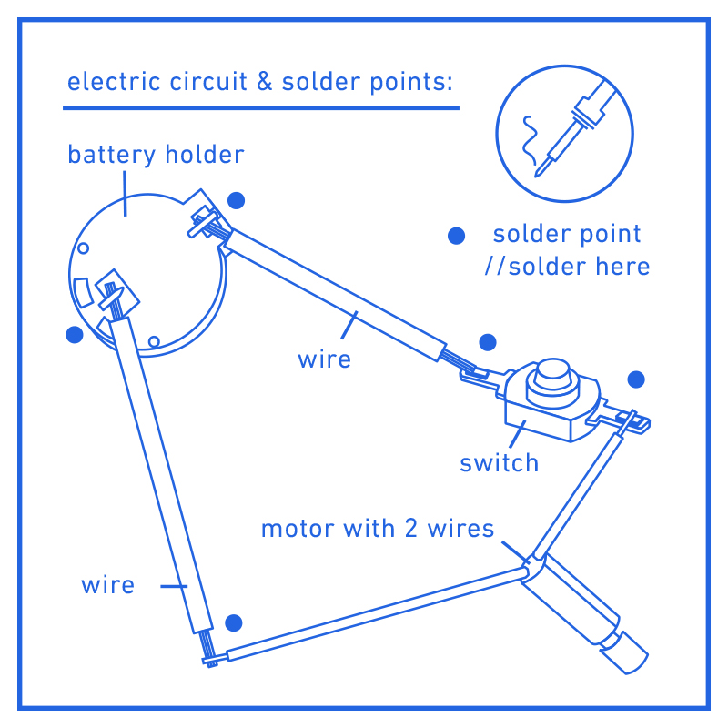

# Shitty Robot
A very easy circuit to power a little robot with a vibration motor.

 

- Status: **Complete**
- Difficulty: **1/5**

### Parts List

| Quantity | Name            | Description                        |
|----------|-----------------|------------------------------------|
| 1        | Vibration Motor | 3V 12mA, as used in mobile phones  |
| 1        | Battery Holder  | CR2032 Battery Holder              |
| 1        | Battery CR2032  |                                    |
| 1        | Switch          | 2 pins                             |
| 2        | Cables          |                                    |

### Manual
You can find the manual and pictures of every step in the manual folder.

### Parts
For everybody who wants to build them at home. Here are the sources for the important parts:

- **Vibration motor**
  - aliexpress.com (Search for "vibration motor 3v", best take some with short wires and no plug)
- **Battery Holder**
  - ebay.de (Search for "CR2032 Batteriehalter")
  - aliexpress.com (Search for "CR2032 Battery Holder")
- **Battery CR2032**
  - Everywhere, cheapest ebay or alibaba.com

### Copyright and Authorship
- Hardware / Idea: [CC-BY-SA 4.0](https://creativecommons.org/licenses/by-sa/4.0/) - [Nadine Trautzsch](https://nadine-trautzsch.de) - [Binary Kitchen e.V.](https://www.binary-kitchen.de)
- Illustrations: [CC-BY-SA 4.0](https://creativecommons.org/licenses/by-sa/4.0/) - [Nadine Trautzsch](https://nadine-trautzsch.de)
- Manual (TeX): [LPPL](https://www.latex-project.org/lppl.txt) - [Marei Peischl](https://peitex.de)
- Manual (pdf): [CC-BY-SA 4.0](https://creativecommons.org/licenses/by-sa/4.0/) - [Christoph Schindlbeck](https://github.com/datoffy) - [Binary Kitchen e.V.](https://www.binary-kitchen.de)
