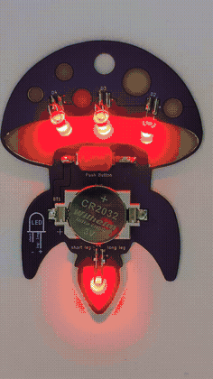
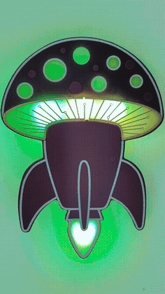
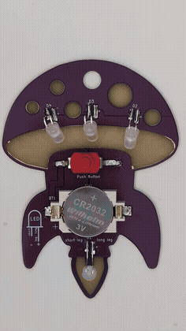

# Video Assets

This folder contains the source clips and converted animations for the Mushroom Rocket project.

## Converted GIF

### backside_glow.gif



### frontside_glow.gif



### switch_on_front_and_back_side.gif



## FFmpeg Tutorial: Convert MP4 to GIF

This is a high-quality two-step palette workflow.

### 1) Generate a palette

```bash
ffmpeg -y -i "Switch On Front And Back Side.mp4" \
  -vf "fps=8,scale=236:420:flags=lanczos,palettegen=max_colors=128:stats_mode=diff" \
  palette.png
```

### 2) Create the GIF using the palette

```bash
ffmpeg -y -i "Switch On Front And Back Side.mp4" -i palette.png \
  -lavfi "fps=8,scale=236:420:flags=lanczos[x];[x][1:v]paletteuse=dither=bayer" \
  switch_on_front_and_back_side.gif
```

### 3) Optional cleanup

```bash
rm palette.png
```

On PowerShell, use:

```powershell
Remove-Item palette.png
```

## Tuning Tips

- Keep `fps=8` for smooth motion with manageable size.
- Increase size/quality: raise resolution (for example `280:500`) or `max_colors`.
- Decrease size: lower resolution, lower fps, or reduce `max_colors` (for example `64`).
- Keep portrait layout without rotation by using a portrait scale, where width is smaller than height.


## Embedded Videos (original files, might not work on github)

### backside_glow.webm

<video src="backside_glow.webm" controls muted loop playsinline width="320"></video>

### frontside_glow.webm

<video src="frontside_glow.webm" controls muted loop playsinline width="320"></video>

### Switch On Front And Back Side.mp4

<video src="Switch%20On%20Front%20And%20Back%20Side.mp4" controls muted loop playsinline width="320"></video>

### switch_on_front_and_back_side.webm

<video src="switch_on_front_and_back_side.webm" controls muted loop playsinline width="320"></video>