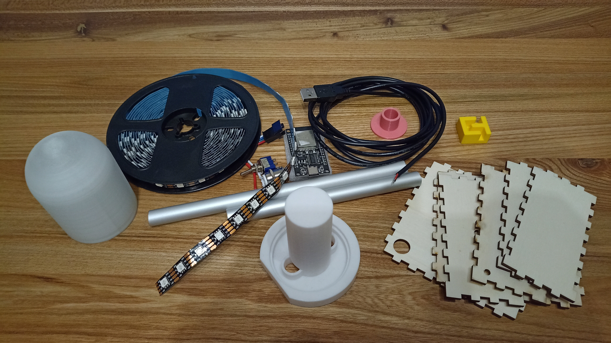
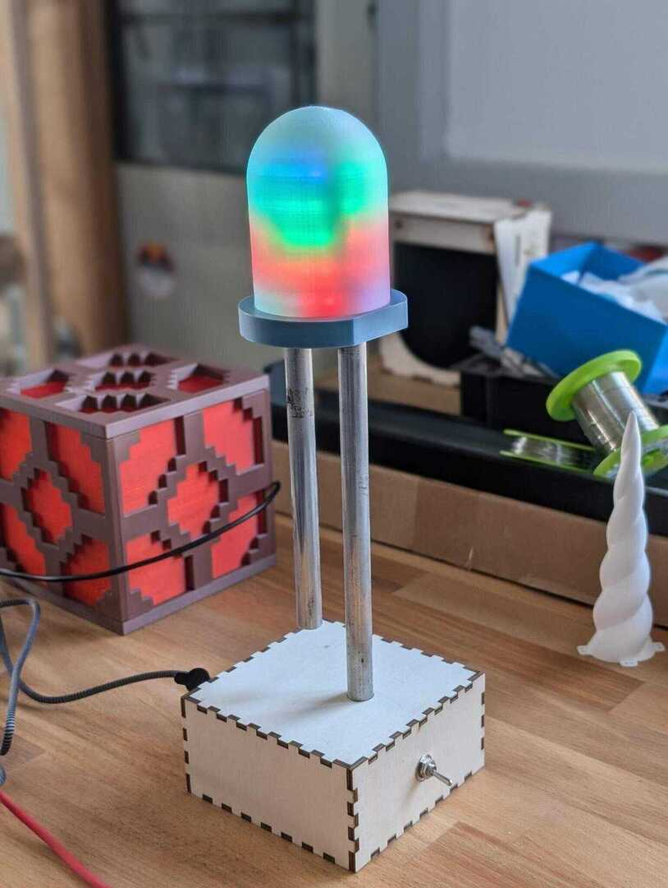

# Smart LED

A huge THT LED Desk Lamp, Powered by the awesome [Wled](https://github.com/Aircoookie/WLED) project.

 

- Status: **Complete**
- Difficulty: **5/5**

### Parts List

Find printable parts on [Printables](https://www.printables.com/model/1030468-giant-smart-led)

| Description                   | Quantity |
|-------------------------------|----------|
| ESP32                         |     1    |
| 3D Printed Parts              |     4    |
| 12mm Aluminium Pipe           |   35cm   |
| WS2812 LED Stripe             |  ca.0,5m |
| Wood Parts                    |     6    |
| USB-A cable (one open end)    |     1    |
| 11mm Push Button              |     1    |
| 5mm Toggle Switch             |     1    |
| Stranded Wire                 |  ca. 2m  |
| Wood Glue                     |          |
| Glue                          |          |

### Copyright and Authorship

- Design: [CC-BY-SA 4.0](https://creativecommons.org/licenses/by-sa/4.0/) - Mario Langhammer

### Buy Kit
Stay Tuned!!
