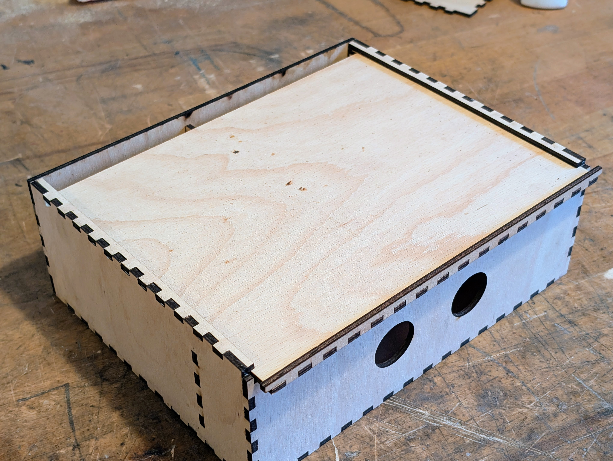
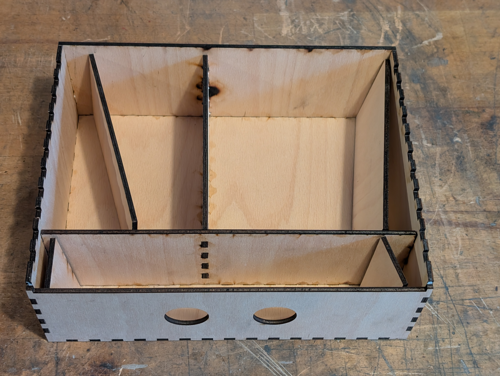

# SolderBox - All you need in one box

We have designed a soldering box for you that is extra small but still contains everything you need. The box offers space for a complete soldering working place and is still so small that four of the boxes fit into a small Euro box.

 

- Status: **Complete**
- Difficulty: **2/5**

### Parts List

| Description                   | Quantity |
|-------------------------------|----------|
| Wooden Parts					| 15	   |
### Copyright and Authorship

- Board: [CC-BY-SA 4.0](https://creativecommons.org/licenses/by-sa/4.0/) - [blinkyparts GmbH](https://shop.blinkyparts.com)

### Buy Soldering Kits
If you want to buy the parts for a box? You can find everything here: [shop.blinkyparts.com](https://shop.blinkyparts.com/de/Loetbox-Ein-Loetarbeitsplatz-in-einer-Box/blink23103)
