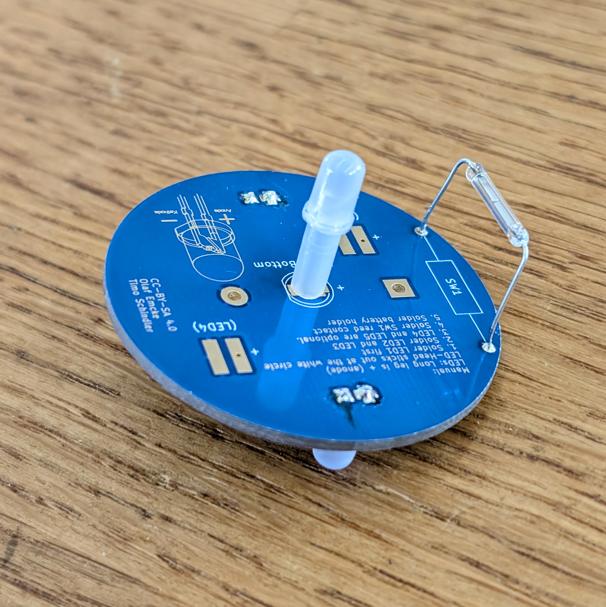

# Space Eggs - Glowing Rocket-Egg

The **Space Eggs** is a fun and beginner-friendly **soldering kit** combined with **3D-printed components**. It features an interactive mechanism where turning the egg aligns a **magnetic switch (reed switch)** with a **magnet**, powering on the three **RGB LEDs**. This creates a stunning light effect inside the egg and the flame underneath the rocket-shaped egg cup.

 

- Status: **Complete**
- Difficulty: **2/5**

### Parts List

| Quantity | Description |
|:--------:|:-----------|
| 3 | RGB LEDs (5 mm) |
| 1 | LED Spacer |
| 1 | Egg (two parts) |
| 1 | Rocket Egg Cup (3D-printed, optional) |
| 1 | Flame Base (3D-printed, optional) |
| 1 | Reed Switch (Magnetic Switch) |
| 1 | CR2032 Battery Holder |
| 1 | CR2032 Battery (not included) |
| 1 | 8x2 mm Neodymium Magnet |
| 1 | Space Eggs PCB |

### Copyright and Authorship

- Board: [CC-BY-SA 4.0](https://creativecommons.org/licenses/by-sa/4.0/) - Olaf Emke and Timo Schindler @ [blinkyparts.com](https://shop.blinkyparts.com)

### Buy Soldering Kits
Unfortunately, you can't just buy this great elephant. We are only allowed to give the elephants to organizations that take part in the “Türen auf mit der Maus” day. Are you one of these organizations? Please get in touch with us: [shop.blinkyparts.com](https://shop.blinkyparts.com/de/Space-Eggs-Leuchtender-Loetbausatz-mit-3D-gedrucktem-Raketen-Eierbecher/blink23128)
