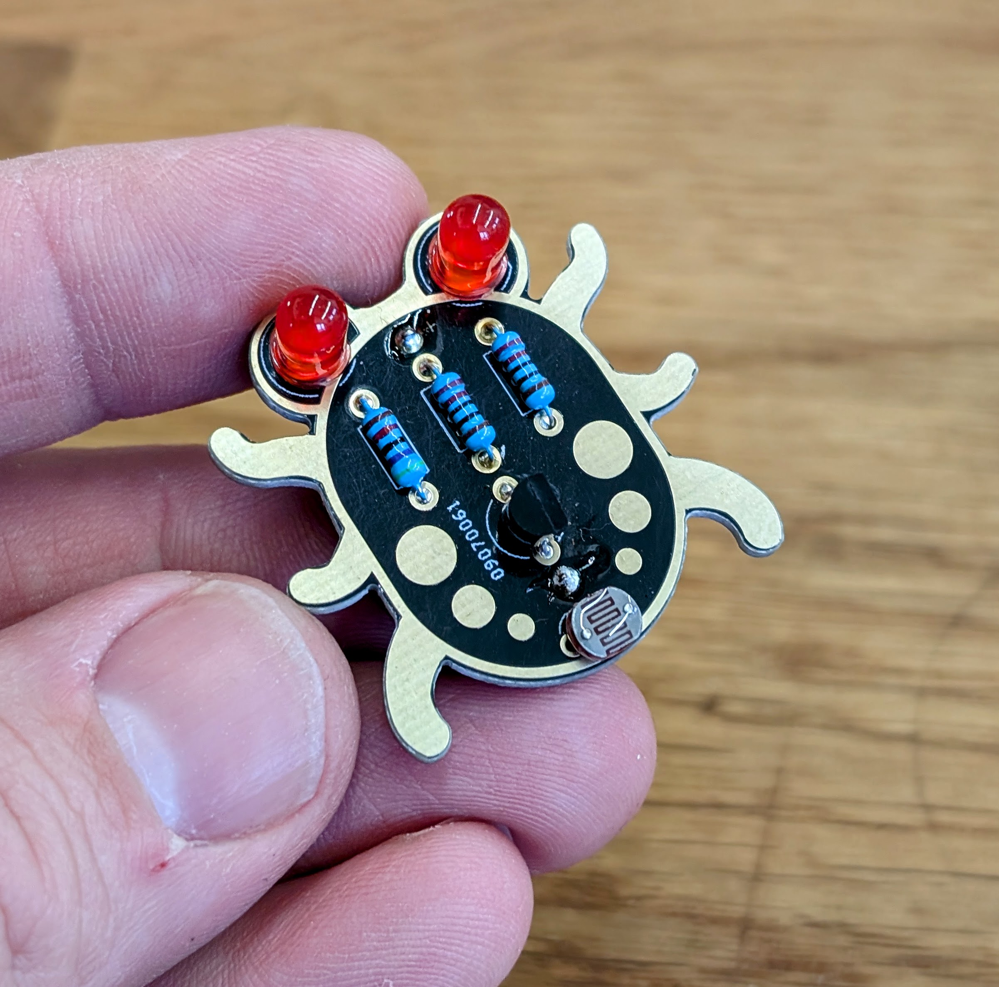
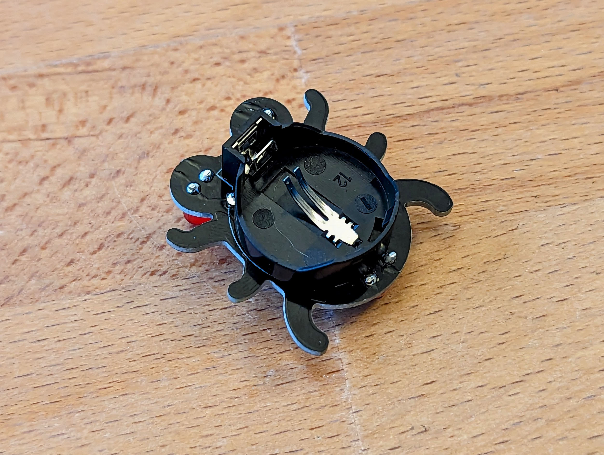

# Weevil Eye soldering set - LEDbeetle with sensor

The kit is a very easy kit with push-through parts, which is explicitly aimed at beginners. It has only a few parts, so even small children can easily assemble it. Once assembled, the red LED “eyes” light up brighter or dimmer depending on how much light falls on the photo sensor. 

 

- Status: **Complete**
- Difficulty: **2/5**

### Parts List

| Description                   | Quantity |
|-------------------------------|----------|
| LEDs red 5mm                  |     2    |
| Resistor 220R                 |     2    |
| Resistor 47k                  |     1    |
| LDR		                    |     1    |
| Transistor                    |     1    |
| Battery Holder                |     1    |
| CR2032 Battery (not included) |     1    |
| WeevilEye (PCB)				|     1    |

### Copyright and Authorship

- Board: [CC-BY-SA 3.0](https://creativecommons.org/licenses/by-sa/3.0/) - [Jordan McConnel](https://www.sparkfun.com/products/10723)

### Buy Soldering Kits
If you want to buy the parts and PCB for a soldering kit you can find everything here: [shop.blinkyparts.com](https://shop.blinkyparts.com/de/Weevil-Eye-Loetset-Leuchtkaefer-mit-Sensor/blink23104)
